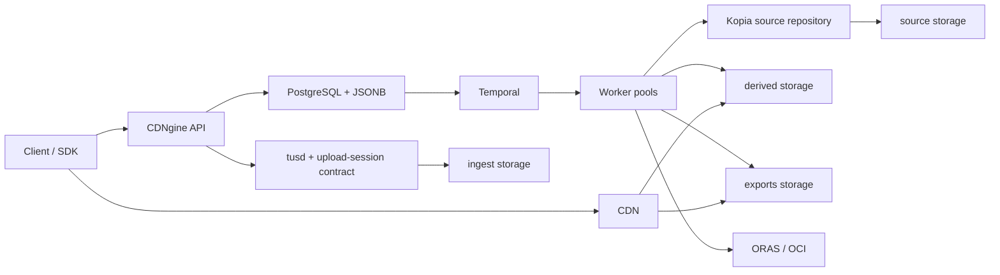
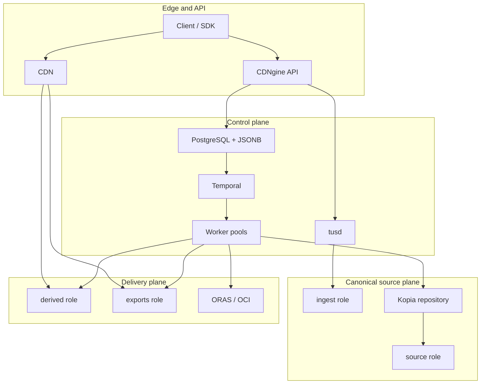
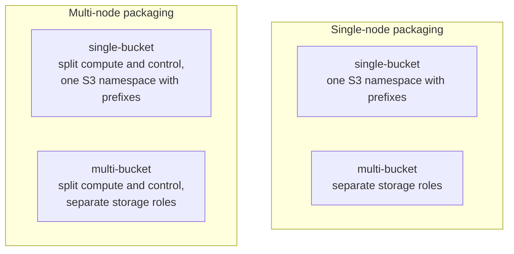
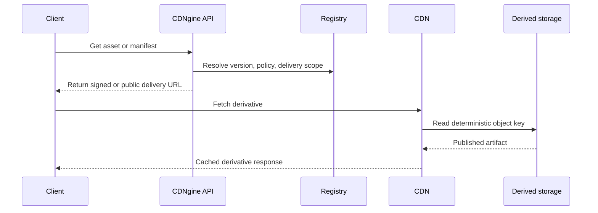
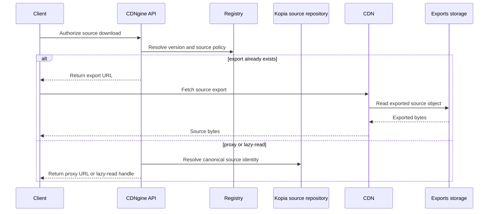

CDNgine is an asset ingest, processing, and delivery platform for products that need one system for **canonical source storage, durable workflow orchestration, deterministic derivatives, and CDN-friendly delivery**.

It is designed for workloads such as:

- images and textures
- video
- presentations and PDFs
- archives and package-like assets
- future file types added through explicit capability and workflow registration

## Core model

CDNgine separates four concerns that most asset systems blur together:

1. **ingest**: clients upload through a stable API and resumable upload target
2. **canonical source**: originals are snapshotted into a deduplicated canonical source plane
3. **processing**: workers derive deterministic outputs through durable workflows
4. **delivery**: published artifacts are served from a derived delivery plane in front of a CDN

The intended default flow is:

`client -> API -> tusd/staging -> canonical source snapshot -> Temporal workflow -> derived publication -> CDN`

### Platform at a glance



The important split is:

- the **canonical source plane** exists for provenance, deduplication, replay, and storage-efficient retention
- the **derived delivery plane** exists for browser-friendly published artifacts and hot delivery

Public clients should not need to understand Kopia, SeaweedFS, ORAS, Nydus, or Temporal directly. They talk to **CDNgine APIs and SDKs**.

Client-facing reads stay unified even when storage is not. A caller asks CDNgine to authorize a delivery or source download once, and CDNgine resolves that request to the right internal path: **CDN-backed derivative**, **materialized export**, or **canonical-source reconstruction**.

There is **not** a normal "move bytes from the CDN to cold storage" flow. The **CDN is an edge cache** for published derivatives and exports: it fills on cache miss and evicts by cache policy. **Hot/warm/cold movement happens in the origin storage layers behind the CDN**, using the selected substrate:

- **RustFS** policy-based object tiering for simple or local S3-compatible deployments
- **SeaweedFS** tiered storage and admin moves for fuller hot/warm/cold substrate control
- **Alluxio**, **Nydus**, and worker-local caches for internal hot-read acceleration near compute

CDNgine owns the **policy decision and materialization contract** for publish, export, replay, and lazy-read authorization. It should not reinvent byte-tiering engines in app code when the storage systems already provide them.

### Revisions of the same logical asset

CDNgine distinguishes the **logical asset** from each immutable **uploaded source version**:

- the `Asset` is the stable logical identity
- each intentional new upload for that asset creates a new `AssetVersion`
- a retry of the **same** mutating request converges on the same upload session and version through idempotency
- a **new revision** goes through canonicalization, workflow dispatch, and publication again for its own version

That means `v1`, `v2`, and `v3` remain separately replayable and auditable even when they share bytes underneath. **Kopia** may deduplicate shared source content internally, but that does not collapse version identity in CDNgine.

### Logical roles



This diagram is the **logical model** only. The same roles can be packaged on one node or many nodes, and they can use one bucket or many buckets.

### Supported topology matrix



All four combinations are supported as long as the same logical roles are preserved.

| Node topology | Storage topology | Supported | Typical posture |
| --- | --- | --- | --- |
 | single-node | single-bucket | yes | smallest install; one S3-compatible bucket with role prefixes |
 | single-node | multi-bucket | yes | current local fast-start shape, but still one physical host |
 | multi-node | single-bucket | yes | split compute and control plane first, keep one bucket with role prefixes |
 | multi-node | multi-bucket | yes | fuller production shape with stronger policy and lifecycle separation |

### Published derivative path



### Original-source path



## Default reference stack

CDNgine is opinionated about the default stack, but not about one mandatory infrastructure vendor.

| Concern | Default |
| --- | --- |
| HTTP and API layer | **Hono** |
| host shell | **Encore** or **Nest** |
| database access and migrations | **Prisma** |
| registry database | **PostgreSQL + JSONB** |
| cache and short-lived coordination | **Redis** |
| resumable ingest | **tus / tusd** |
| durable workflows | **Temporal** |
| canonical source repository | **Kopia** |
| tiered storage substrate | **SeaweedFS** by default, **JuiceFS** when POSIX workspace semantics matter |
| lazy internal reads | **Nydus** plus optional **Alluxio** |
| artifact graph and immutable bundles | **ORAS / OCI artifacts** |
| image processing and delivery | **imgproxy + libvips** |
| video processing | **FFmpeg** |
| document normalization | **Gotenberg** |
| derived delivery origin | **S3-compatible object storage + CDN** |
| optional branch/publish semantics | **lakeFS**, only when that workflow is needed |

The architecture is intentionally biased toward **running upstream systems directly** instead of reimplementing chunking, snapshotting, lazy reads, artifact graphs, or workflow bookkeeping in application code.

## High-performance lifecycle posture

If the goal is to make CDNgine as fast and modern as possible without turning it into a research project, the reference posture should be:

1. **keep originals immutable and versioned** in the canonical source repository
2. **treat derivatives as deterministic, disposable materializations**
3. **use three distinct fast paths**:
   - CDN edge cache for public delivery
   - hot origin tier for currently popular derivatives and exports
   - worker-local or near-worker hot cache for canonical-source reads
4. **promote by measured hotness, not just age**
5. **demote by rebuild cost plus demand decay**, not by naive TTL alone
6. **mirror small hot sets across tiers when bursts make migration too slow**
7. **keep manifests, indexes, and tiny metadata objects hotter than bulk binaries**

That means the fastest practical lifecycle model for CDNgine is:

- **canonical originals** stay immutable and replayable
- **published derivatives** are aggressively cached and can be rebuilt
- **exports** are short-lived materializations, not long-term truth
- **tiny, high-fanout metadata** gets finer-grained hot promotion than large blobs
- **learned eviction and predictive prewarm** are optional shield/origin optimizations after the baseline is proven

The detailed policy lives in [Storage Tiering And Materialization](./docs/storage-tiering-and-materialization.md).

## What CDNgine owns

CDNgine should own:

- public, platform-admin, and operator APIs
- registry state for assets, versions, derivatives, manifests, idempotency, and auditability
- workflow composition and processor registration
- delivery policy, signing, and manifest semantics
- adapter boundaries around the storage and orchestration stack

CDNgine should consume:

- **tusd** for resumable uploads
- **Kopia** for canonical source history
- **SeaweedFS** and optional **JuiceFS** for substrate and workspace behavior
- **Temporal** for durable orchestration
- **ORAS** for artifact publication
- **Nydus** and optional **Alluxio** for selected hot-read paths

## API posture

CDNgine exposes three surfaces:

| Surface | Audience | Compatibility expectation |
| --- | --- | --- |
| `public` | product clients and generated SDKs | stable, versioned contract |
| `platform-admin` | internal platform owners | documented internal API |
| `operator` | operators and recovery tooling | documented internal API |

The **public** surface is the product contract. The platform-admin and operator surfaces are deliberate, but they are not the broad public SDK promise.

## Current repository state

The repository now has a real TypeScript workspace foundation as well as the documentation set. It currently includes:

- root `package.json`, npm workspaces, and shared TypeScript config
- workspace package metadata that records governing docs, mandatory programming-practices docs, and external references
- reference-header checks for TypeScript source files in `apps/` and `packages/`
- the local fast-start dependency stack under `deploy/local-platform`
- the architecture and service model docs that the implementation must follow

The repository is still implementation-light by design. It is defining and beginning to enforce:

- the architecture and service model
- canonical source, tiering, and delivery rules
- public API and SDK posture
- persistence, lifecycle, idempotency, and workflow contracts
- observability, security, SLOs, runbooks, and threat models

That work comes before a larger implementation push because this platform has too many moving parts to safely improvise its semantics later.

## Workspace bootstrap

The repository now uses **npm workspaces** as the lowest-friction baseline because Node and npm are available in the contributor environment by default.

From the repository root:

```powershell
npm install
npm run verify
```

The important root commands are:

- `npm run docs:check` - verify workspace metadata and source reference headers
- `npm run typecheck` - run the composite TypeScript workspace typecheck
- `npm run build` - build the current workspace graph
- `npm run test` - run repo checks and workspace tests
- `npm run verify` - run lint, typecheck, and test together

Each workspace in `apps/*` and `packages/*` carries `cdngine` metadata in its `package.json` so the implementation stays coupled to:

- governing local docs
- the mandatory `docs/regular-programming-practices/` suite
- upstream references that justify external-system behavior

## Local fast-start

The easiest supported local path lives in [deploy/local-platform](./deploy/local-platform/README.md).

That fast-start profile is currently **single-node + multi-bucket** by default:

- one local host for API dependencies and storage services
- separate RustFS buckets for staging, canonical-source repository storage, derived delivery, and exports

It can be collapsed into **single-node + single-bucket** by reusing one bucket name with distinct prefixes.

For Windows PowerShell:

```powershell
powershell -NoProfile -ExecutionPolicy Bypass -File .\deploy\local-platform\start.ps1
```

That brings up PostgreSQL, Redis, Temporal, RustFS, tusd, Kopia, and a local OCI registry with one command.

## Read in this order

1. [docs/architecture.md](./docs/architecture.md)
2. [docs/service-architecture.md](./docs/service-architecture.md)
3. [docs/upstream-integration-model.md](./docs/upstream-integration-model.md)
4. [docs/api-surface.md](./docs/api-surface.md)
5. [docs/technology-profile.md](./docs/technology-profile.md)
6. [docs/package-reference.md](./docs/package-reference.md)
7. [docs/README.md](./docs/README.md)

## Key documentation

The full documentation index lives at [docs/README.md](./docs/README.md).

Important entry points:

- [Architecture](./docs/architecture.md)
- [Service Architecture](./docs/service-architecture.md)
- [Canonical Source And Tiering Contract](./docs/canonical-source-and-tiering-contract.md)
- [Storage Tiering And Materialization](./docs/storage-tiering-and-materialization.md)
- [Upstream Integration Model](./docs/upstream-integration-model.md)
- [API Surface](./docs/api-surface.md)
- [SDK Strategy](./docs/sdk-strategy.md)
- [Technology Profile](./docs/technology-profile.md)
- [Package And Repository Reference](./docs/package-reference.md)
- [Environment And Deployment](./docs/environment-and-deployment.md)
- [Local Platform](./deploy/local-platform/README.md)
- [Implementation Ledger](./docs/implementation-ledger.md)
- [Traceability](./docs/traceability.md)
