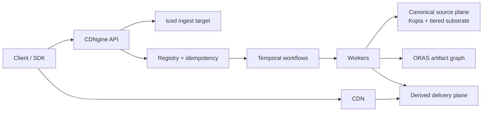
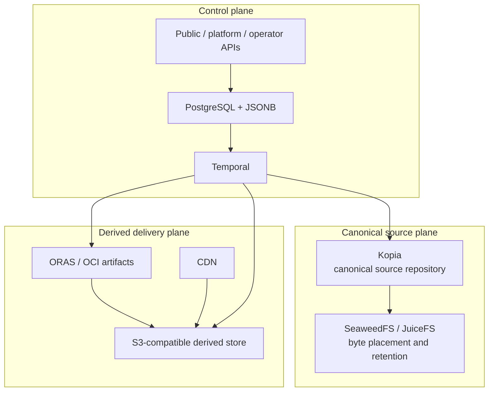
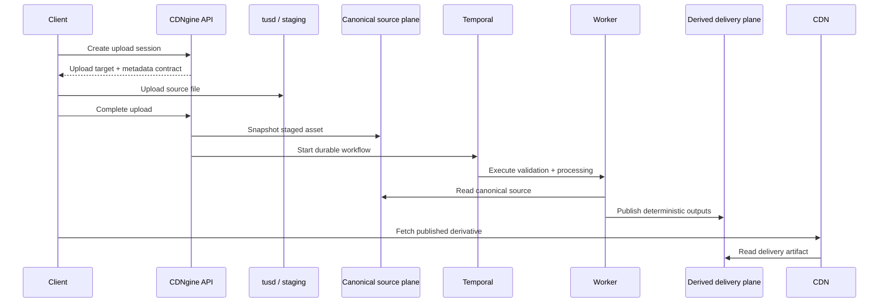

CDNgine is an asset ingest, processing, and delivery platform for products that need one system for **canonical source storage, durable workflow orchestration, deterministic derivatives, and CDN-friendly delivery**.

It is designed for workloads such as:

- images and textures
- video
- presentations and PDFs
- archives and package-like assets
- future file types added through explicit capability and workflow registration

## Core model

CDNgine separates four concerns that most asset systems blur together:

1. **ingest**: clients upload through a stable API and resumable upload target
2. **canonical source**: originals are snapshotted into a deduplicated canonical source plane
3. **processing**: workers derive deterministic outputs through durable workflows
4. **delivery**: published artifacts are served from a derived delivery plane in front of a CDN

The intended default flow is:

`client -> API -> tusd/staging -> canonical source snapshot -> Temporal workflow -> derived publication -> CDN`

### Platform at a glance



The important split is:

- the **canonical source plane** exists for provenance, deduplication, replay, and storage-efficient retention
- the **derived delivery plane** exists for browser-friendly published artifacts and hot delivery

Public clients should not need to understand Kopia, SeaweedFS, ORAS, Nydus, or Temporal directly. They talk to **CDNgine APIs and SDKs**.

### What lives where



### Upload to delivery



## Default reference stack

CDNgine is opinionated about the default stack, but not about one mandatory infrastructure vendor.

| Concern | Default |
| --- | --- |
| HTTP and API layer | **Hono** |
| host shell | **Encore** or **Nest** |
| database access and migrations | **Prisma** |
| registry database | **PostgreSQL + JSONB** |
| cache and short-lived coordination | **Redis** |
| resumable ingest | **tus / tusd** |
| durable workflows | **Temporal** |
| canonical source repository | **Kopia** |
| tiered storage substrate | **SeaweedFS** by default, **JuiceFS** when POSIX workspace semantics matter |
| lazy internal reads | **Nydus** plus optional **Alluxio** |
| artifact graph and immutable bundles | **ORAS / OCI artifacts** |
| image processing and delivery | **imgproxy + libvips** |
| video processing | **FFmpeg** |
| document normalization | **Gotenberg** |
| derived delivery origin | **S3-compatible object storage + CDN** |
| optional branch/publish semantics | **lakeFS**, only when that workflow is needed |

The architecture is intentionally biased toward **running upstream systems directly** instead of reimplementing chunking, snapshotting, lazy reads, artifact graphs, or workflow bookkeeping in application code.

## What CDNgine owns

CDNgine should own:

- public, platform-admin, and operator APIs
- registry state for assets, versions, derivatives, manifests, idempotency, and auditability
- workflow composition and processor registration
- delivery policy, signing, and manifest semantics
- adapter boundaries around the storage and orchestration stack

CDNgine should consume:

- **tusd** for resumable uploads
- **Kopia** for canonical source history
- **SeaweedFS** and optional **JuiceFS** for substrate and workspace behavior
- **Temporal** for durable orchestration
- **ORAS** for artifact publication
- **Nydus** and optional **Alluxio** for selected hot-read paths

## API posture

CDNgine exposes three surfaces:

| Surface | Audience | Compatibility expectation |
| --- | --- | --- |
| `public` | product clients and generated SDKs | stable, versioned contract |
| `platform-admin` | internal platform owners | documented internal API |
| `operator` | operators and recovery tooling | documented internal API |

The **public** surface is the product contract. The platform-admin and operator surfaces are deliberate, but they are not the broad public SDK promise.

## Current repository state

The repository is documentation-heavy on purpose. It is defining:

- the architecture and service model
- canonical source, tiering, and delivery rules
- public API and SDK posture
- persistence, lifecycle, idempotency, and workflow contracts
- observability, security, SLOs, runbooks, and threat models

That work comes before a larger implementation push because this platform has too many moving parts to safely improvise its semantics later.

## Local fast-start

The easiest supported local path lives in [deploy/local-platform](./deploy/local-platform/README.md).

For Windows PowerShell:

```powershell
powershell -NoProfile -ExecutionPolicy Bypass -File .\deploy\local-platform\start.ps1
```

That brings up PostgreSQL, Redis, Temporal, RustFS, tusd, Kopia, and a local OCI registry with one command.

## Read in this order

1. [docs/architecture.md](./docs/architecture.md)
2. [docs/service-architecture.md](./docs/service-architecture.md)
3. [docs/upstream-integration-model.md](./docs/upstream-integration-model.md)
4. [docs/api-surface.md](./docs/api-surface.md)
5. [docs/technology-profile.md](./docs/technology-profile.md)
6. [docs/package-reference.md](./docs/package-reference.md)
7. [docs/README.md](./docs/README.md)

## Key documentation

The full documentation index lives at [docs/README.md](./docs/README.md).

Important entry points:

- [Architecture](./docs/architecture.md)
- [Service Architecture](./docs/service-architecture.md)
- [Canonical Source And Tiering Contract](./docs/canonical-source-and-tiering-contract.md)
- [Storage Tiering And Materialization](./docs/storage-tiering-and-materialization.md)
- [Upstream Integration Model](./docs/upstream-integration-model.md)
- [API Surface](./docs/api-surface.md)
- [SDK Strategy](./docs/sdk-strategy.md)
- [Technology Profile](./docs/technology-profile.md)
- [Package And Repository Reference](./docs/package-reference.md)
- [Environment And Deployment](./docs/environment-and-deployment.md)
- [Local Platform](./deploy/local-platform/README.md)
- [Implementation Ledger](./docs/implementation-ledger.md)
- [Traceability](./docs/traceability.md)
