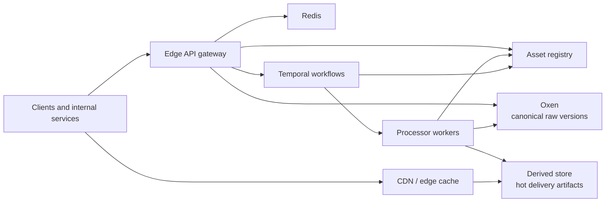
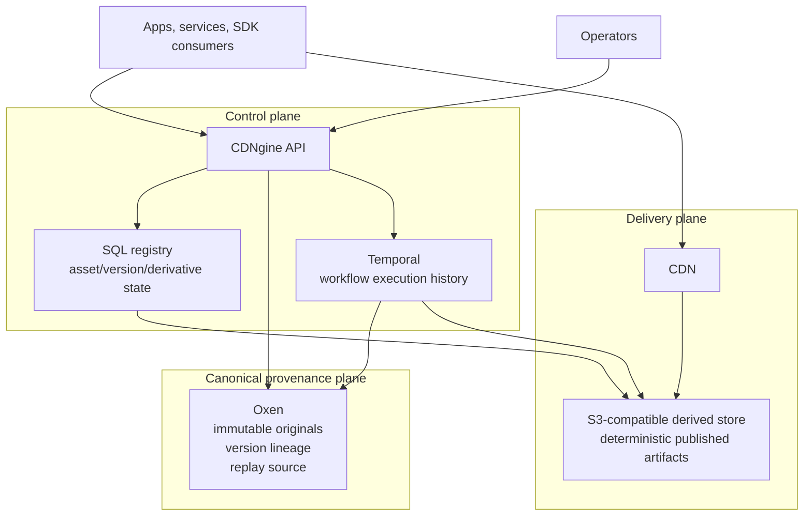
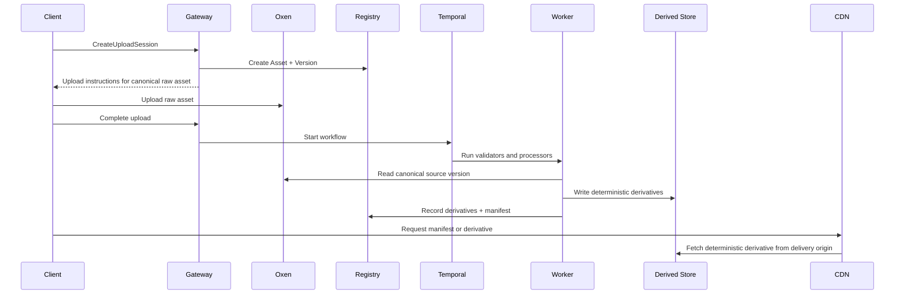
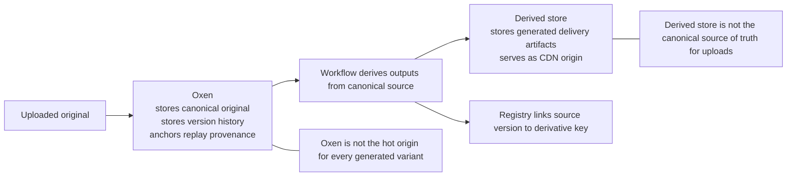
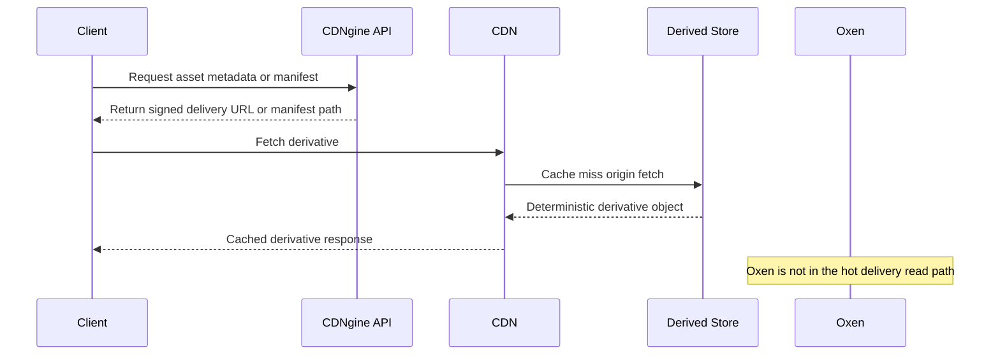
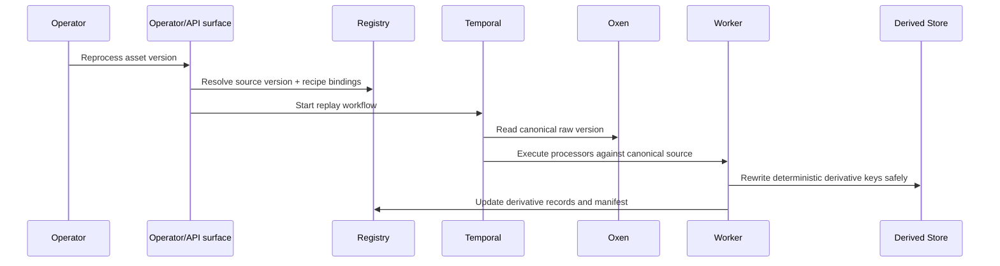
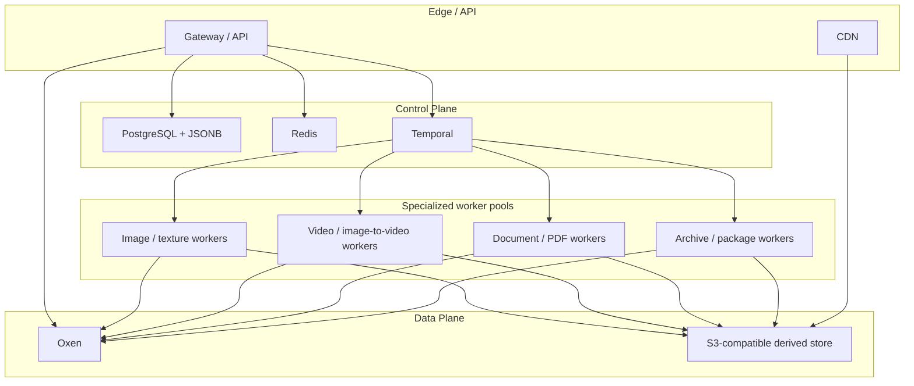
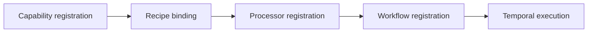

# Architecture

This document defines the intended reference architecture for CDNgine as a high-performance, durable, extensible asset processing and delivery platform.

It is meant to be good enough to implement against, review critically, and adapt without rediscovering the entire system design from scratch.

## 1. Purpose

CDNgine exists to provide one standardized asset platform for many products and internal domains:

- creative services
- operations and tooling
- marketplaces
- virtual event platforms
- CMS and content libraries
- future domains that need asset ingest, derivation, and deterministic delivery

The platform must make it easy to:

- ingest arbitrary binary assets through a stable API
- preserve the original as the canonical versioned source
- derive optimized delivery artifacts
- serve those derivatives globally with predictable performance
- add new workflows and file types without redesigning the platform
- let adopters keep the public API and platform contract while bringing their own infrastructure where needed

## 2. Goals

The platform must:

- preserve immutable originals as the canonical source of truth
- expose a stable HTTP API and portable SDK surface
- support both opinionated defaults and bring-your-own infrastructure
- make new workflows, recipes, and file types easy to register in code
- stay TDD-first, maintainable, observable, and replayable
- bias strongly toward consuming proven packages and services rather than rebuilding primitives

## 3. Non-goals

The platform does not define:

- product-specific business rules
- moderation policy
- frontend UI design
- one mandatory infrastructure provider for every adopter
- a requirement that every adopter use the exact same SQL engine or S3 provider

## 4. Architectural principles

### 4.1 Immutable raw assets

Every upload is preserved immutably in Oxen. Derived artifacts are never treated as the source of truth.

### 4.2 Separate control plane and data plane

Metadata, policy, workflow state, and audit state belong in the control plane. Raw and derived binaries belong in the data plane.

### 4.3 Deterministic derivative identity

Every derivative should be addressable by a stable key derived from:

- namespace or tenant
- asset ID
- source version
- recipe ID
- schema version
- optional content hash when needed

### 4.4 Durable orchestration for expensive work

Inline validation may happen at ingest time, but expensive or failure-prone work belongs in durable workflows, not request handlers.

### 4.5 Extensibility through registration, not branching

New file types and workflows should be added through:

1. capability registration
2. recipe binding
3. processor registration
4. workflow registration

Core services should not need scattered conditionals every time a new asset class appears.

### 4.6 Opinionated defaults with explicit substitution points

The platform should recommend a high-confidence stack, but define the contracts well enough that adopters can swap their SQL database, S3-compatible storage, CDN, or execution environment if they preserve the platform semantics.

### 4.7 TDD-first and contract-first delivery

Architecture, schemas, tests, examples, and implementation should move together. The design is not complete if it only exists as prose.

## 5. Default stack direction

The current default reference profile is:

| Layer | Default |
| --- | --- |
| raw/versioned source of truth | **Oxen** |
| metadata registry | **PostgreSQL + JSONB** |
| low-latency coordination and cache | **Redis** |
| durable orchestration | **Temporal** |
| image delivery and transform server | **imgproxy** backed by **libvips** |
| document normalization | **Gotenberg** |
| video processing | **FFmpeg** with hardware acceleration where available |
| derived delivery store | **S3-compatible object storage** |
| CDN profile | Cloudflare-friendly default deployment profile |

### 5.1 Why these defaults

- **Oxen**: version semantics and immutable raw asset provenance
- **PostgreSQL + JSONB**: strong relational core plus flexible metadata fields, queryability, and wide operational adoption
- **Redis**: mature, fast coordination for cache, locks, and short-lived state without pretending to be durable truth
- **Temporal**: strong retries, replay, visibility, long-running workflow semantics, and testing support
- **imgproxy + libvips**: high-performance, production-proven image processing without writing a custom image pipeline
- **Gotenberg**: API-first document conversion over LibreOffice and Chromium rather than building custom PPT/PDF normalization infrastructure
- **FFmpeg**: still the strongest general-purpose video and image-to-video processing foundation with deep hardware acceleration support
- **S3-compatible storage**: lets adopters keep their own object storage while preserving deterministic delivery semantics

## 6. Supported substitution points

The platform should preserve the public API and processor contracts even when infrastructure changes.

| Layer | Default | Substitution rule |
| --- | --- | --- |
| raw source of truth | Oxen | fixed |
| metadata registry | PostgreSQL + JSONB | any SQL database that preserves relational registry semantics |
| cache and coordination | Redis | Redis-compatible or equivalent behavior is acceptable if operational semantics remain clear |
| orchestration | Temporal | alternate durable workflow engine only if it preserves retries, replay, visibility, and workflow ownership semantics |
| derived store | S3-compatible storage | any S3-compatible provider or equivalent object-storage contract |
| CDN origin | Cloudflare-friendly profile | any CDN that preserves deterministic cache and signed-delivery behavior |
| processor runtime | containerized workers | any runtime that preserves the processor contract and observability model |

## 7. System model



## 7.1 System context



## 7.2 Upload-to-delivery flow



### 7.2.1 Plain-language interpretation

Read the sequence above as:

1. the original upload goes to **Oxen**
2. workflows and workers use **Oxen** as the canonical source for validation and derivation
3. generated outputs are published to the **derived store**
4. clients receive those published outputs from the **CDN** in front of the derived store

That means:

- **Oxen owns ingest provenance and replay**
- **the derived store owns published delivery artifacts**
- **the CDN is the ordinary client delivery path**

## 7.3 Provenance versus delivery responsibility



## 7.4 Delivery read path



## 7.5 Replay and reprocessing path



## 7.6 Deployment profile



## 8. Control plane and data plane

### 8.1 Control plane

Owns:

- asset metadata
- version lineage
- namespace registration
- capability registration
- recipe bindings
- workflow and job state
- validation results
- manifests and derivative records
- audit events

### 8.2 Data plane

Owns:

- raw binaries in Oxen
- derived binaries in S3-compatible storage
- transient processor scratch space
- CDN cache state

This separation keeps provenance, delivery performance, and retention behavior independently manageable.

## 9. Core components

### 9.1 Edge API gateway

Owns:

- authentication and authorization
- upload-session creation
- asset completion callbacks
- metadata and derivative lookup APIs
- signed delivery URLs
- namespace-aware request routing and policy enforcement

The gateway should stay thin. It validates, authorizes, and dispatches. It should not own expensive transforms.

### 9.2 Asset registry

Owns:

- asset metadata
- version lineage
- derivative records
- workflow and job state
- validation results
- service and namespace registration
- standardized domain-owned metadata written by multiple internal services

The default metadata database is PostgreSQL with JSONB for extensible fields, manifest fragments, processor outputs, and domain-specific structured metadata.

### 9.3 Raw asset source of truth

Oxen is mandatory for immutable raw asset provenance and version semantics.

This gives the architecture one clear answer to:

- where originals live
- what version is canonical
- what replay should derive from

Oxen's responsibility is **not** "be the hot delivery origin for every generated artifact." Its responsibility is:

- preserve the canonical uploaded binary
- preserve version lineage and provenance
- provide the immutable replay source for every later derivation run
- anchor auditability when recipes, workers, or schemas change over time

By default, CDNgine treats Oxen as the **source-of-truth asset ledger for originals**, not as the storage system that must serve every delivery-path read.

### 9.4 Durable orchestration

Temporal owns:

- upload-completion orchestration
- validation fan-out
- recipe expansion
- retry and timeout policy
- replay and dead-letter recovery
- progress and operator-visible execution history

This layer should be code-defined and explicit. Hidden queue choreography is not acceptable for the critical derivation path.

### 9.5 Processor runtime

Workers execute recipe steps for:

- image transforms
- image-to-video derivation
- video transcoding
- presentation normalization and slide rasterization
- archive/package inspection
- malware and content scanning
- future custom file types

Workers should stay narrow and composable. A processor should own one clear transformation or inspection concern and describe its inputs, outputs, retry posture, and resource profile as data.

### 9.6 Cache and coordination

Redis accelerates:

- upload-session lookups
- dedupe and replay windows
- short-lived locks
- workflow coordination helpers
- hot metadata or manifest caching

Redis is not durable truth and must not become the platform's hidden state machine.

### 9.7 Derived delivery origin

Derived artifacts are written under deterministic keys to S3-compatible storage and served through CDN paths and manifests.

They do **not** go back through Oxen by default because the delivery profile optimizes for:

- very high read throughput
- low-latency CDN origin behavior
- overwrite-safe idempotent writes to deterministic keys
- independent retention and purge policy for derivatives
- cost separation between canonical provenance storage and hot delivery storage

If every generated thumbnail, poster, HLS segment, slide image, and future derivative had to round-trip back into Oxen, the platform would couple the delivery plane to the provenance plane too tightly. That makes hot delivery, cache invalidation, derivative churn, and retention policy harder to operate.

## 10. Storage model

Separate stores exist for separate purposes:

| Store | Role | System of record |
| --- | --- | --- |
| Oxen | immutable raw assets and version history | yes for originals |
| SQL metadata registry | metadata, state, manifests, registrations | yes for platform state |
| S3-compatible derived store | delivery artifacts | yes for processed variants |
| Redis | cache, locks, ephemeral coordination | no |

### 10.1 Why derivatives do not default to Oxen

The split is intentional:

1. **Oxen answers provenance questions.** What was uploaded, when, by whom, under what version, and what exact source should replay use?
2. **The derived store answers delivery questions.** What exact optimized artifact should the CDN fetch right now under a deterministic key?
3. **The registry binds the two together.** It records which source version, recipe version, and schema version produced which derivative key.

That means the derivation contract is:

`Oxen source version` + `recipe binding` + `schema version` -> `deterministic derived object key`

The platform can therefore replay from Oxen whenever needed without forcing the delivery path to read from Oxen on every request.

### 10.2 When Oxen would hold more than originals

An adopter could choose a stricter profile where Oxen also stores selected published artifacts, but that should be treated as an **optional archival or compliance profile**, not the default hot-path design.

Reasonable cases include:

- regulatory retention of selected published outputs
- forensic preservation of specific release bundles
- long-term archival of important manifests or packaged artifact sets

Even in that stricter profile, the recommended delivery origin for hot traffic is still the derived store in front of the CDN.

## 11. Multi-service registration model

The platform supports multiple internal domains by requiring code-defined registration for:

- service namespace
- asset classes
- allowed recipes
- retention and visibility policy
- workflow bindings
- metadata schema version

This lets `creative-services`, `operations`, and future domains use one standardized asset model without collapsing their ownership boundaries.

The architecture should treat this as a first-class platform feature, not a later convenience layer:

- each domain registers in code
- each domain binds allowed asset classes and recipes
- each domain can attach structured metadata in a standardized registry model
- the shared registry remains queryable across domains without forcing every team into a separate schema philosophy

## 12. Workflow and file-type extensibility

The platform is intentionally generic:

- workflows are registered declaratively
- file types are introduced through capability registration, not core-service branching
- processors declare supported MIME types, outputs, resource profile, retry policy, and schema version

Adding `MYNEWFILETYPE` should require:

1. a capability schema entry
2. one or more recipe bindings
3. a processor implementation
4. a workflow binding

The same pattern should support:

- new derivative recipes for existing file types
- domain-specific workflows such as image-to-video backwall generation
- inspection-only flows for risky binary types
- new service-owned namespace policies without orchestrator rewrites

### 12.1 Registration model



## 13. Workload coverage

### 13.1 Backwall media

Inputs:

- `.mp4`
- `.png`
- `.jpg`

Behavior:

- if input is image, derive a video asset for playback-oriented slots
- if input is video, trigger transcoding pipeline on upload completion

Outputs:

- delivery video
- poster frame
- manifest

### 13.2 Booth texture

Behavior:

- validate dimensions
- re-encode to WebP
- generate deterministic slices, regions, or tiles for frontend composition

### 13.3 Art gallery and banners

Behavior:

- validate dimensions and declared policy
- preserve original
- produce WebP and thumbnails where required

### 13.4 Presentations

Inputs:

- PDF
- PowerPoint

Behavior:

- normalize to PDF when needed
- rasterize each slide or page
- publish slide manifest

### 13.5 Packages and archives

Inputs:

- Unity packages
- Substance assets
- zip archives
- arbitrary binaries

Behavior:

- preserve originals
- optionally inspect contents
- extract inventory manifest
- optionally scan for malware

## 14. Delivery model

The platform favors:

- deterministic derived object keys
- manifest-first retrieval for complex asset classes
- immutable cache headers for versioned variants
- controlled on-demand image transforms
- stable delivery URLs regardless of backing infrastructure choice

Illustrative derived layout:

```text
/{namespace}/{assetId}/{versionId}/{recipeId}/{schemaVersion}/{filename}
```

## 15. Reliability model

The platform is designed for durability:

- idempotent upload completion
- replay-safe events and workflow steps
- explicit terminal and retryable failure states
- dead-letter review and replay
- auditability from upload to published derivative

Redis can accelerate locks, dedupe windows, and hot-path coordination, but it must never replace the registry or workflow engine as the source of truth.

## 16. Security model

The platform should support:

- namespace- or tenant-scoped authn and authz
- presigned uploads with short TTLs
- MIME sniffing and file-signature validation
- private origin access between processors and storage
- signed delivery URLs for private assets
- operator-only replay, purge, and quarantine actions
- audit logging for upload, transform, replay, delete, and policy changes

## 17. Observability model

Every service should expose:

- structured logs
- W3C trace context propagation
- request latency and error metrics
- dependency metrics
- asset and recipe success metrics
- workflow backlog and replay visibility

Key platform signals:

- ingest latency
- workflow queue lag
- processor success by recipe
- dead-letter backlog
- replay volume
- CDN cache-hit ratios

## 18. Developer-experience model

The developer contract is part of the architecture:

- stable, versioned HTTP APIs
- schema-driven SDK generation
- rich metadata for editor autocomplete and inline docs
- typed errors and typed manifests
- code-registered service and workflow definitions
- tested examples instead of only prose descriptions

## 19. Why consume packages instead of rebuilding

The platform should aggressively reuse:

- **Temporal** rather than inventing a durable workflow runtime
- **imgproxy/libvips** rather than building image resizing and delivery internals
- **Gotenberg** rather than custom Office/PDF normalization services
- **FFmpeg** rather than a custom media pipeline
- **PostgreSQL JSONB** rather than inventing a bespoke metadata engine for the first production version

Custom code should focus on:

- namespace and policy registration
- deterministic key generation
- capability and recipe registry
- public API contract
- orchestration composition
- manifest semantics

## 20. References

- [Temporal documentation](https://docs.temporal.io/)
- [Temporal TypeScript SDK](https://github.com/temporalio/sdk-typescript)
- [Temporal TypeScript samples](https://github.com/temporalio/samples-typescript)
- [imgproxy documentation](https://docs.imgproxy.net/)
- [imgproxy repository](https://github.com/imgproxy/imgproxy)
- [Gotenberg documentation](https://gotenberg.dev/)
- [Gotenberg repository](https://github.com/gotenberg/gotenberg)
- [FFmpeg documentation](https://ffmpeg.org/documentation.html)
- [PostgreSQL JSON types](https://www.postgresql.org/docs/current/datatype-json.html)
- [Redis documentation](https://redis.io/docs/latest/)
- [OpenAPI Specification](https://spec.openapis.org/oas/latest.html)
- [AsyncAPI documentation](https://www.asyncapi.com/docs)
- [RFC 9457: Problem Details for HTTP APIs](https://www.rfc-editor.org/rfc/rfc9457.html)

## 21. Read more

- [Domain Model](./domain-model.md)
- [API Surface](./api-surface.md)
- [API Style Guide](./api-style-guide.md)
- [SDK Strategy](./sdk-strategy.md)
- [Pipeline Capability Model](./pipeline-capability-model.md)
- [Workflow Extensibility](./workflow-extensibility.md)
- [Service Registration Model](./service-registration-model.md)
- [Engineering Guide](./engineering.md)
- [ADR Index](./adr/README.md)
