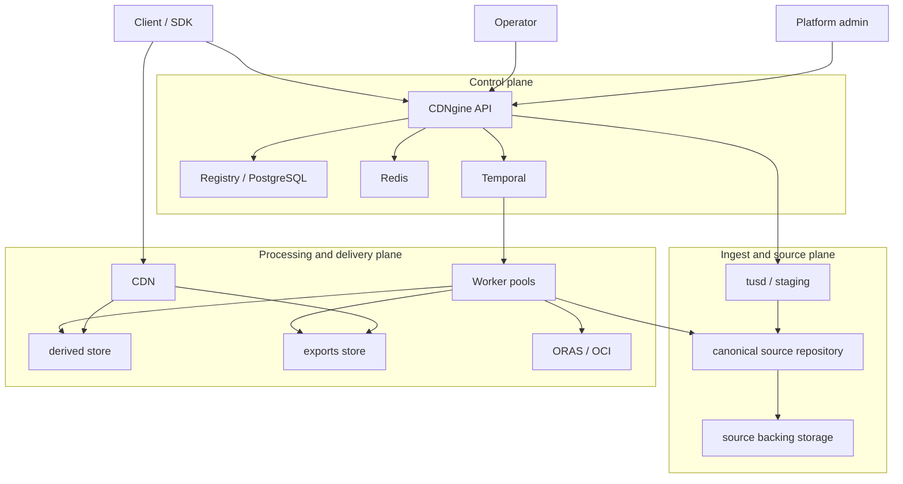
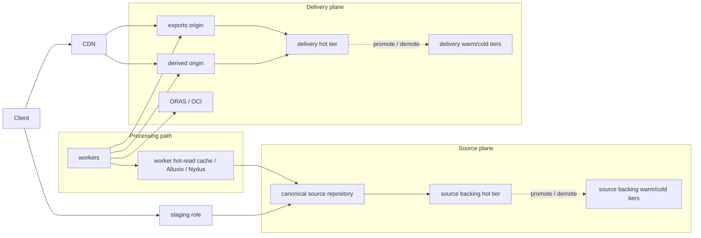
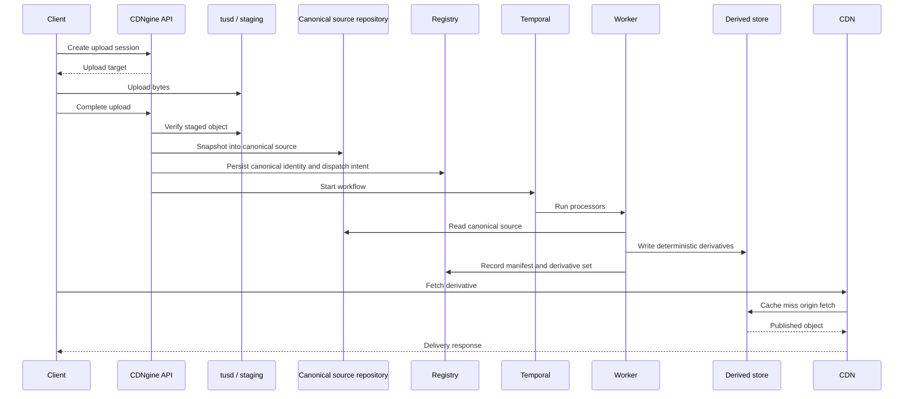
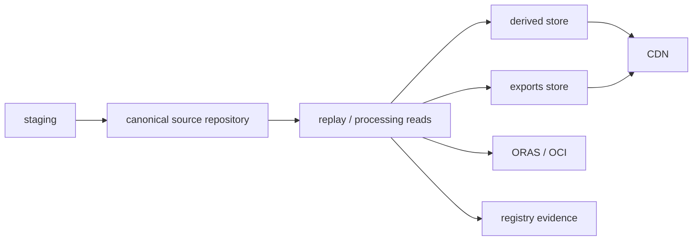
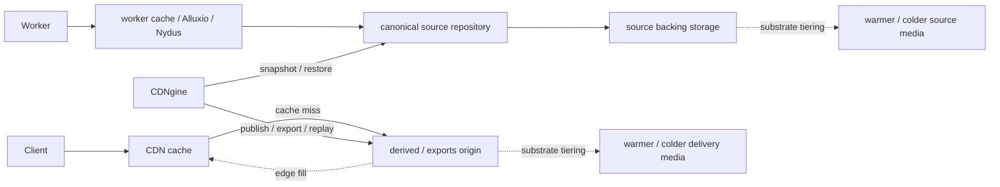
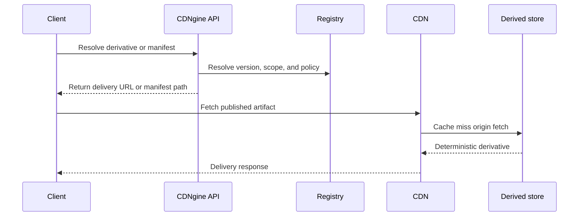
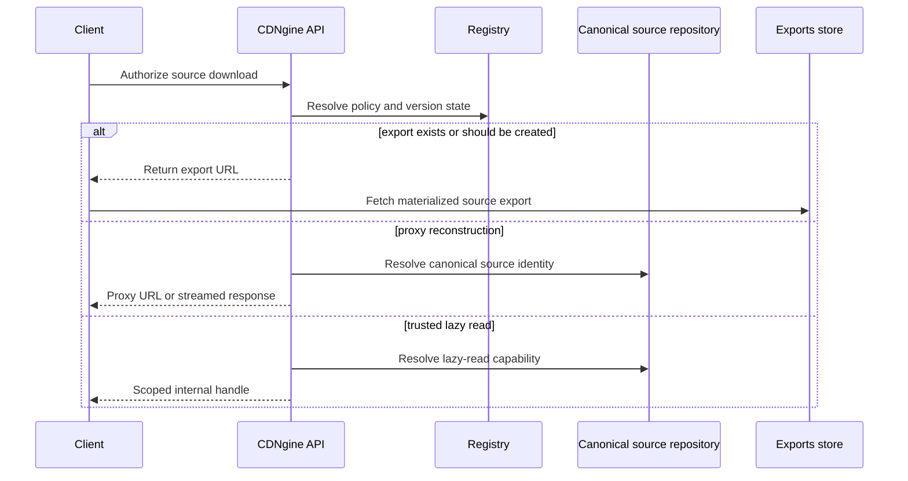
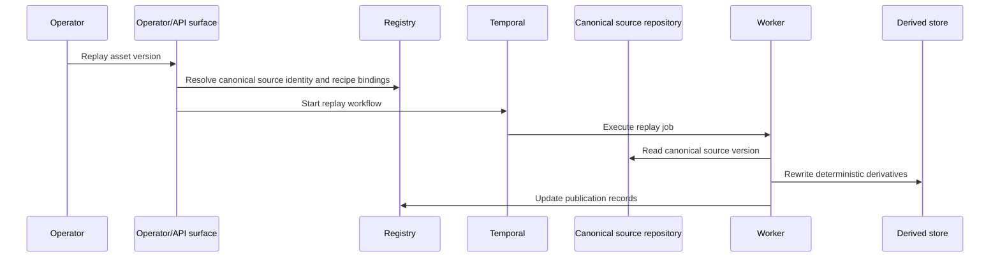
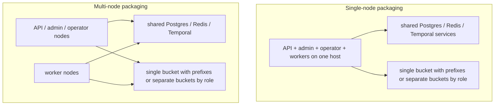
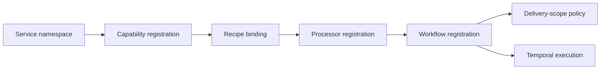

# Architecture

This document is the implementation-facing source of truth for how CDNgine works.

If you are trying to understand the platform quickly, read these sections in order:

1. **Section 3: the lifecycle**
2. **Section 4: what is truth and where it lives**
3. **Section 5: how bytes move between hot, warm, and cold**
4. **Section 6: how clients read derivatives and originals**

Everything else exists to support those four ideas.

## 1. Purpose

CDNgine exists to do one job cleanly:

- accept uploads through a stable API
- preserve the original as immutable canonical source
- derive deterministic outputs through durable workflows
- deliver those outputs through a fast CDN-facing plane
- replay or rebuild later without losing provenance

The platform is meant to work across multiple products and internal domains without redesigning the system every time a new file type or workflow appears.

## 2. Non-negotiable model

There are four rules that define the architecture:

1. **uploads land in staging first**
2. **originals become truth only after canonicalization**
3. **durable workflows produce delivery artifacts**
4. **clients normally read from the delivery plane, not the canonical source plane**

Those rules are why the platform stays understandable under load, retries, and replay.

### 2.1 Logical system architecture

This is the structural view that the old document was missing.



The point of this diagram is to show the platform shape:

- the **API and registry** are the control plane
- **tusd** handles resumable staging
- **the canonical source repository plus backing storage** hold canonical source truth, with **Xet** as the default engine for new canonicalizations and **Kopia** retained temporarily for legacy reads during migration
- **Temporal plus workers** perform durable processing
- **derived and exports stores behind the CDN** handle delivery

### 2.2 Storage and data-plane architecture

This is the byte-flow and storage-role view.



This diagram exists to make three boundaries obvious:

1. staged uploads are **not** canonical truth
2. canonical originals cool inside the **source plane**
3. published derivatives and exports cool inside the **delivery plane**, with the CDN only caching reads

## 3. The lifecycle

This is the real platform lifecycle in one sequence.



### 3.1 Read this literally

The sequence above means:

1. the upload is **not** canonical when it is still in staging
2. canonical truth begins only after the original is committed into the **canonical source repository**
3. workflows always start from canonical source, not from staging
4. derivatives are published into the **derived store**
5. the CDN sits in front of the derived store for normal delivery

### 3.2 Asset-version lifecycle

The platform has many records, but this is the lifecycle that matters most:

| Phase | Meaning |
| --- | --- |
| `uploaded` | staged bytes exist and completion was accepted |
| `canonicalizing` | the staged object is being verified and snapshotted into canonical source |
| `canonical` | immutable source identity now exists and will not change |
| `processing` | a durable workflow is creating or validating outputs |
| `published` | required derivatives and manifest are durable and readable |
| failure / quarantine states | processing stopped and operator or retry logic is required |

The full state machine lives in [State Machines](./state-machines.md). This document explains the architecture around that state machine.

The single most important rule is:

> Once a version becomes **canonical**, that canonical source identity does not change.

### 3.3 Same asset, multiple revisions

When a client uploads the "same file" again as a real new revision, CDNgine should treat that as:

- one stable `Asset`
- many immutable `AssetVersion` records

The logical flow is:

1. the API looks up or creates the logical `Asset`
2. the API creates a **new** `AssetVersion` and `UploadSession`
3. **tusd** accepts the bytes into staging on the configured S3-compatible substrate
4. completion verification snapshots that staged object into the canonical source repository, using **Xet** by default for new canonicalizations
5. the registry persists canonical source identity for that version
6. the workflow dispatcher starts a **Temporal** workflow keyed to that exact version
7. workers publish derivatives and manifests for that version only
8. the `Asset` may move a mutable "current" pointer to the latest canonical or published version if policy allows

The important distinction is:

- **duplicate request retry** = converge on the same upload session and version
- **intentional new revision** = create a new version and repeat canonicalize -> process -> publish for that version

Underlying deduplication may still reuse shared bytes in the canonical source plane, but CDNgine keeps the business identity of each version separate. The current backend-selection posture is repository-engine neutral in the control plane while the rollout target is explicit in operations: **Xet** is the default engine for new canonicalizations, and **legacy Kopia-backed versions remain readable** until migration, backfill, and signoff retire the old path. That universal byte-level dedupe posture applies to every file type; semantic normalization remains capability-owned and optional, and unknown formats still fall back to preserve-original plus digest evidence and only proven container inventory.

## 4. What is truth, and where does it live?

The old document got muddy here. This is the cleaner version.

| System | What it stores | Is it source of truth? | Used for |
| --- | --- | --- | --- |
| staging | resumable in-flight uploads | no | upload ergonomics and completion boundary |
| canonical source repository | immutable originals and replayable source history | yes for originals | provenance, deduplication, replay |
| registry | lifecycle state, manifests, derivative records, policy, audit | yes for metadata | API, workflow coordination, operators |
| derived store | published deterministic derivatives | yes for delivery artifacts | CDN origin |
| exports store | optional materialized source downloads | yes for export objects only | repeated original downloads |
| ORAS / OCI | immutable bundles and artifact graphs | yes when bundle publication is used | release bundles and artifact references |
| CDN | cached edge copies of derivatives or exports | no | fast client reads |

This is the core split:

- **canonical source repository** = original truth
- **derived store** = delivery truth
- **registry** = control-plane truth
- **CDN** = cache, not truth

## 4.1 Visual truth boundaries



That diagram is intentionally simple. The structural architecture lives in Sections **2.1** and **2.2**. This one only shows truth boundaries:

- uploads enter through staging
- originals become canonical in source
- processing reads canonical source
- outputs go to derived, exports, registry, and optional ORAS bundles
- clients normally hit the CDN, not the source repository

## 5. Hot, warm, and cold

The lifecycle becomes clearer if each object class is handled separately instead of pretending everything cools the same way.

| Object class | Created by | Starts hot where? | Cools how? | Becomes hot again by? |
| --- | --- | --- | --- | --- |
| canonical original | canonicalization | source-repository metadata plus active worker read path | backing source substrate can place older chunks or media on cooler tiers | replay, validation, or later processing |
| deterministic derivative | worker publication | derived origin plus CDN edge if requested | CDN evicts edge copies; origin storage may demote or delete according to policy | CDN miss, explicit prewarm, or replay |
| source export | export materialization | exports origin plus CDN edge if requested | short TTL, lifecycle policy, or explicit deletion | new export from canonical source |
| manifest and small metadata | publication flow | registry cache and origin hot tier | should cool more slowly than bulk blobs because fan-out is high | normal reads, publish bursts, replay |
| ORAS bundle | worker publication | OCI registry and any active pull cache | registry retention or lifecycle policy | republish or pull again |

That table is the actual lifecycle model:

- **originals cool inside the source plane**
- **derivatives cool inside the delivery plane**
- **exports are temporary**
- **metadata stays hotter than large binaries**

## 5.1 Who moves bytes



This means:

1. **CDN** caches edge copies of derivatives and exports
2. **RustFS or SeaweedFS** own origin-tier movement in the underlying storage substrate
3. **Alluxio, Nydus, or worker-local caches** accelerate repeated worker reads
4. **CDNgine** only performs business-level movement

Business-level movement means:

- snapshot staged bytes into canonical source
- publish a derivative
- materialize an export
- replay from canonical source
- prewarm a path deliberately because policy requires it

CDNgine does **not** normally implement a generic "move hot objects to cold storage" loop inside route handlers or workflow code.

## 5.2 What the storage systems do

The storage responsibilities are:

| Layer | Responsibility |
| --- | --- |
| CDN | cache fill and cache eviction at the edge |
| RustFS | simple S3-compatible origin plus lifecycle and object-tiering policies when that profile is used |
| SeaweedFS | richer hot/warm/cold substrate control when fuller placement policy is needed |
| Alluxio / Nydus / worker cache | accelerate repeated reads near compute |
| CDNgine | decide when to publish, export, replay, or prewarm |

That separation is important. The architecture should consume these systems, not reimplement them.

## 6. Read paths

There are two read families. Mixing them is what made the old diagrams confusing.

### 6.1 Published derivative read



This is the ordinary hot path.

The source repository is not part of this read unless a replay or rebuild happens later.

### 6.2 Original-source read



This path is deliberately separate from derivative delivery because source downloads have different latency, privacy, and cost behavior.

## 7. Replay and reprocessing

Replay always starts from canonical source.

Never from staging. Never from a published derivative.



That is why immutable canonical identity matters so much: replay has exactly one place to begin.

## 8. Topology support

Packaging changes do **not** change the lifecycle.

### 8.1 Deployment topology view



| Node topology | Storage topology | Supported | Example |
| --- | --- | --- | --- |
| single-node | single-bucket | yes | one host and one bucket with `ingest/`, `source/`, `derived/`, `exports/` prefixes |
| single-node | multi-bucket | yes | one host and separate buckets by role |
| multi-node | single-bucket | yes | split compute and control, keep one bucket with prefixes |
| multi-node | multi-bucket | yes | split compute and control, separate buckets by role |

The lifecycle is still:

`stage -> canonicalize -> process -> publish -> deliver`

Only packaging changes.

## 9. Component ownership

The clearest way to read the system is to ask what each component owns, and what it does **not** own.

| Component | Owns | Does not own |
| --- | --- | --- |
| API layer | auth, upload sessions, completion acceptance, policy resolution, signed URLs | transforms, generic queue choreography, raw storage internals |
| tusd / staging | resumable upload handling and staged bytes | canonical truth |
| registry | lifecycle state, manifests, derivative records, idempotency, audit | raw binaries |
| canonical source repository | immutable originals, deduplication, replay source identity | hot public derivative delivery |
| Temporal | durable orchestration, retries, visibility, replay-safe execution | object storage truth |
| workers | validation, transforms, publication, replay execution | caller auth policy |
| derived store | published delivery objects | canonical original truth |
| exports store | optional materialized source downloads | canonical original truth |
| CDN | cached edge copies of derivatives and exports | canonical storage, workflow state |
| Redis | short-lived cache and coordination | durable truth |

## 10. Storage roles

CDNgine uses four storage roles that matter operationally:

| Role | Typical path | What lives there |
| --- | --- | --- |
| ingest | `ingest/` or ingest bucket | resumable staged uploads |
| source | `source/` or source bucket | canonical source repository backing data |
| derived | `derived/` or derived bucket | published deterministic derivatives |
| exports | `exports/` or exports bucket | materialized source-download exports |

If the deployment uses one bucket, these are prefixes.

If the deployment uses many buckets, these are separate buckets.

Either way, the control plane should store **logical identities**, not raw object keys, as the contract.

## 11. Multi-service registration model

The platform supports multiple internal domains through code-defined registration of:

- service namespace
- tenant-isolation posture
- asset classes
- allowed recipes
- retention and visibility policy
- workflow bindings
- metadata schema version

A service namespace is an internal adopting domain. It is not the same thing as a tenant or customer identifier.

## 12. Workflow and file-type extensibility

The architecture is intentionally extensible through registration rather than scattered conditionals.

Adding a new file type should require:

1. a capability registration
2. one or more recipe bindings
3. a processor implementation
4. a workflow binding

Every capability registration should also declare a safe normalization fallback. Byte-level source dedupe is universal, but semantic normalization is not: unknown formats must still preserve the original, retain strong digests, and only add generic container inventory when container detection is proven.

### 12.1 Registration model



## 13. Workload coverage

Representative workload families are:

| Workload | Typical outputs |
| --- | --- |
| images and textures | WebP, thumbnails, tiles, region slices |
| video | transcodes, HLS manifests, poster frames, subtitles |
| presentations and PDFs | normalized PDF, page or slide images, manifests |
| archives and packages | inventory manifests, extracted metadata, optional malware scan results |

The architecture should support all of these without changing the core lifecycle.

## 14. Delivery model

The delivery posture favors:

- deterministic derived object keys
- manifest-first retrieval for complex workloads
- immutable cache headers for versioned derivatives
- private-origin access behind the CDN
- delivery scopes that can vary hostnames and paths without changing source truth

Illustrative derived layout:

```text
/{namespace}/{scopeKey}/{assetId}/{versionId}/{recipeId}/{schemaVersion}/{filename}
```

## 15. Reliability model

The platform is designed around:

- idempotent upload completion
- explicit lifecycle states
- replay-safe workflow execution
- durable workflow-dispatch intent
- auditability from upload to published derivative

The highest-risk boundary is:

`upload complete -> canonical source identity durable -> workflow dispatched`

That boundary must always remain explicit.

## 16. Security and observability

### 16.1 Security posture

The architecture assumes:

- scoped authn and authz
- short-lived upload targets
- MIME sniffing and file-signature validation
- private origin access
- signed delivery for private assets
- operator-only replay, purge, and quarantine
- audit logging for upload, transform, replay, delete, and policy changes

### 16.2 Observability posture

Every service should emit:

- structured logs
- trace context
- request latency and error metrics
- workflow backlog and retry visibility
- processor success metrics
- CDN cache-hit signals

## 17. Default stack

The current reference stack is:

| Concern | Default |
| --- | --- |
| API layer | Hono |
| host shell | Encore or Nest |
| metadata registry | PostgreSQL + JSONB |
| short-lived coordination | Redis |
| resumable ingest | tus / tusd |
| durable orchestration | Temporal |
| canonical source repository | Xet for new canonicalizations; Kopia retained temporarily for legacy dual-read migration |
| richer substrate for explicit tiering | SeaweedFS |
| optional POSIX-style workspace substrate | JuiceFS |
| lazy internal hot reads | Nydus plus optional Alluxio |
| artifact graph | ORAS / OCI |
| image processing | imgproxy + libvips |
| video processing | FFmpeg |
| document normalization | Gotenberg |
| delivery origin | S3-compatible object storage + CDN |

## 18. Why consume upstream systems instead of rebuilding

CDNgine should spend its complexity budget on:

- public and operator APIs
- lifecycle state
- deterministic identities
- orchestration composition
- manifests
- registration and policy

It should **not** rebuild:

- resumable upload protocols
- snapshot repositories
- object stores
- workflow engines
- image pipelines
- video pipelines
- office-document converters
- OCI artifact registries

## 19. References

- [Xet deduplication](https://huggingface.co/docs/xet/en/deduplication)
- [Kopia features](https://kopia.io/docs/features/)
- [SeaweedFS tiered storage](https://github.com/seaweedfs/seaweedfs/wiki/Tiered-Storage)
- [JuiceFS architecture](https://juicefs.com/docs/community/architecture)
- [Nydus](https://nydus.dev/)
- [Alluxio documentation](https://documentation.alluxio.io/os-en)
- [ORAS documentation](https://oras.land/docs/)
- [Temporal documentation](https://docs.temporal.io/)
- [imgproxy documentation](https://docs.imgproxy.net/)
- [Gotenberg documentation](https://gotenberg.dev/)
- [FFmpeg documentation](https://ffmpeg.org/documentation.html)
- [RFC 9457: Problem Details for HTTP APIs](https://www.rfc-editor.org/rfc/rfc9457.html)
- [RFC 8246: HTTP Immutable Responses](https://www.rfc-editor.org/rfc/rfc8246.html)
- [RFC 8216: HTTP Live Streaming](https://www.rfc-editor.org/rfc/rfc8216.html)

## 20. Read more

- [Service Architecture](./service-architecture.md)
- [State Machines](./state-machines.md)
- [Domain Model](./domain-model.md)
- [Persistence Model](./persistence-model.md)
- [Idempotency And Dispatch](./idempotency-and-dispatch.md)
- [Original Source Delivery](./original-source-delivery.md)
- [Storage Tiering And Materialization](./storage-tiering-and-materialization.md)
- [Upstream Integration Model](./upstream-integration-model.md)
- [ADR Index](./adr/README.md)
