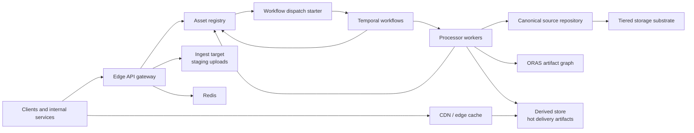
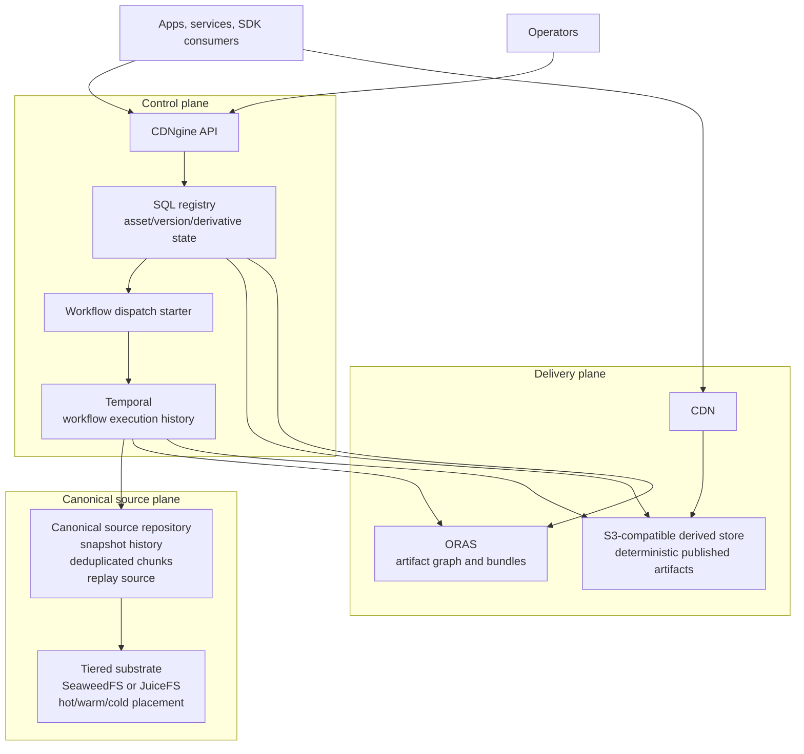
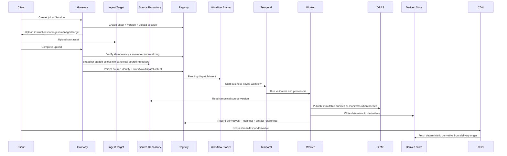
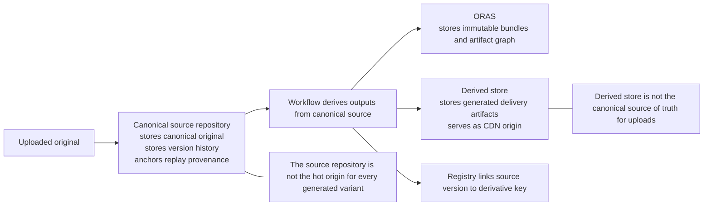
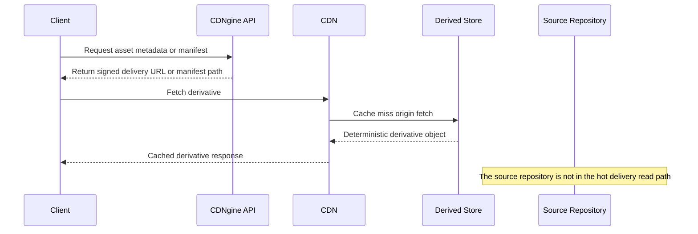
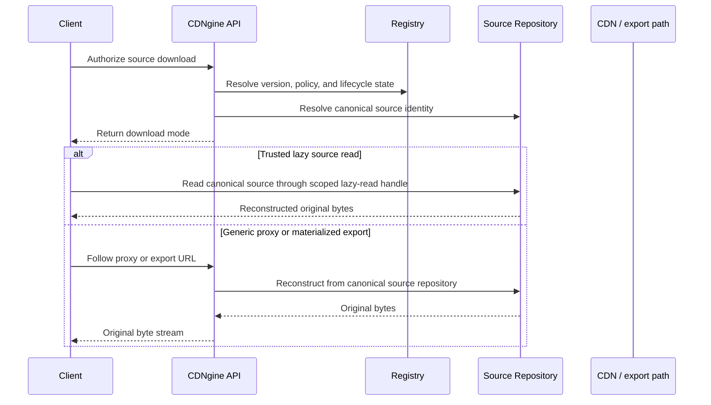
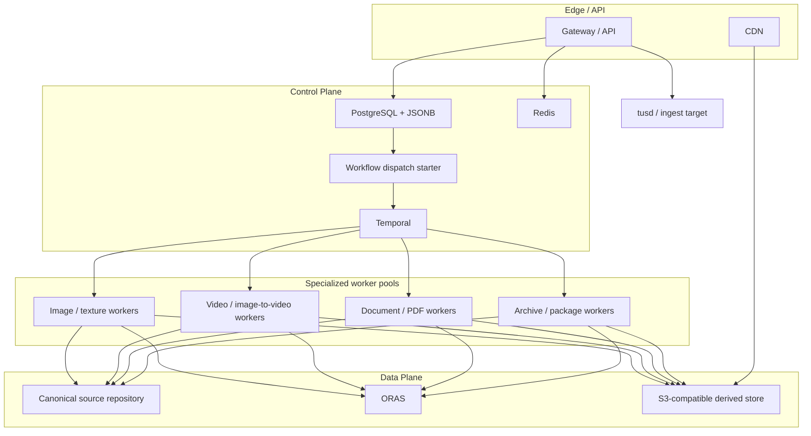
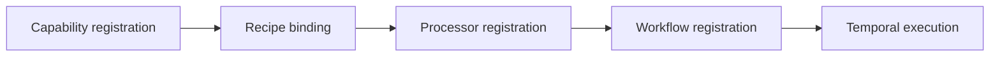

# Architecture

This document defines the intended reference architecture for CDNgine as a high-performance, durable, extensible asset processing and delivery platform.

It is meant to be good enough to implement against, review critically, and adapt without rediscovering the entire system design from scratch.

## 1. Purpose

CDNgine exists to provide one standardized asset platform for many products and internal domains:

- creative services
- operations and tooling
- marketplaces
- virtual event platforms
- CMS and content libraries
- future domains that need asset ingest, derivation, and deterministic delivery

The platform must make it easy to:

- ingest arbitrary binary assets through a stable API
- preserve the original as the canonical versioned source
- derive optimized delivery artifacts
- serve those derivatives globally with predictable performance
- add new workflows and file types without redesigning the platform
- let adopters keep the public API and platform contract while bringing their own infrastructure where needed

## 2. Goals

The platform must:

- preserve immutable originals as the canonical source of truth
- expose a stable HTTP API and portable SDK surface
- support both opinionated defaults and bring-your-own infrastructure
- make new workflows, recipes, and file types easy to register in code
- stay TDD-first, maintainable, observable, and replayable
- bias strongly toward consuming proven packages and services rather than rebuilding primitives

## 3. Non-goals

The platform does not define:

- product-specific business rules
- moderation policy
- frontend UI design
- one mandatory infrastructure provider for every adopter
- a requirement that every adopter use the exact same SQL engine or S3 provider

## 4. Architectural principles

### 4.1 Immutable raw assets

Every upload is preserved canonically in a deduplicated source repository. Derived artifacts are never treated as the source of truth.

### 4.2 Separate control plane and data plane

Metadata, policy, workflow state, and audit state belong in the control plane. Raw and derived binaries belong in the data plane.

### 4.3 Deterministic derivative identity

Every derivative should be addressable by a stable key derived from:

- service namespace
- tenant scope where delivery policy requires it
- asset ID
- source version
- recipe ID
- schema version
- optional content hash when needed

Delivery identity should remain separate from source identity. The same derivative may be reachable through different delivery scopes without changing the underlying published artifact.

### 4.4 Durable orchestration for expensive work

Inline validation may happen at ingest time, but expensive or failure-prone work belongs in durable workflows, not request handlers.

### 4.5 Extensibility through registration, not branching

New file types and workflows should be added through:

1. capability registration
2. recipe binding
3. processor registration
4. workflow registration

Core services should not need scattered conditionals every time a new asset class appears.

### 4.5.1 Programmatic scope

Shared-platform adoption must remain programmatic.

Creative services and operations may both upload files, but the system should scope them through code-defined registrations, scoped resource identity, and policy bindings rather than through separate ad hoc services or route sprawl.

### 4.6 Opinionated defaults with explicit substitution points

The platform should recommend a high-confidence stack, but define the contracts well enough that adopters can swap their SQL database, S3-compatible storage, CDN, or execution environment if they preserve the platform semantics.

### 4.7 TDD-first and contract-first delivery

Architecture, schemas, tests, examples, and implementation should move together. The design is not complete if it only exists as prose.

## 5. Default stack direction

The current default reference profile is:

| Layer | Default |
| --- | --- |
| canonical source repository | **Kopia repository server** |
| tiered storage substrate | **SeaweedFS** by default, **JuiceFS** when POSIX workspace semantics matter |
| metadata registry | **PostgreSQL + JSONB** |
| low-latency coordination and cache | **Redis** |
| durable orchestration | **Temporal** |
| image delivery and transform server | **imgproxy** backed by **libvips** |
| document normalization | **Gotenberg** |
| video processing | **FFmpeg** with hardware acceleration where available |
| lazy internal hot-read path | **Nydus** plus optional **Alluxio** |
| artifact graph and immutable bundle registry | **ORAS / OCI artifacts** |
| derived delivery store | **S3-compatible object storage** |
| CDN profile | Cloudflare-friendly default deployment profile |

### 5.1 Why these defaults

- **Kopia**: the default source repository we should run directly for rolling-hash chunking, deduplicated snapshot history, compression, and replay-friendly canonical source identity
- **SeaweedFS**: tiered byte placement, S3-compatible access, and hot/warm/cold operational storage control
- **JuiceFS**: strong option when shared workspace or POSIX semantics are more important than a pure object-only posture
- **PostgreSQL + JSONB**: strong relational core plus flexible metadata fields, queryability, and wide operational adoption
- **Redis**: mature, fast coordination for cache, locks, and short-lived state without pretending to be durable truth
- **Temporal**: strong retries, replay, visibility, long-running workflow semantics, and testing support
- **imgproxy + libvips**: high-performance, production-proven image processing without writing a custom image pipeline
- **Gotenberg**: API-first document conversion over LibreOffice and Chromium rather than building custom PPT/PDF normalization infrastructure
- **FFmpeg**: still the strongest general-purpose video and image-to-video processing foundation with deep hardware acceleration support
- **Nydus**: the default lazy-read component for chunk-addressed on-demand loading on package-like or rebuildable hot paths
- **ORAS**: immutable artifact graph and bundle publication without inventing a bespoke manifest registry
- **S3-compatible storage**: lets adopters keep their own object storage while preserving deterministic delivery semantics

## 6. Supported substitution points

The platform should preserve the public API and processor contracts even when infrastructure changes.

| Layer | Default | Substitution rule |
| --- | --- | --- |
| canonical source repository | Kopia | any source repository that preserves immutable snapshot identity, deduplicated history, and replay-safe reconstruction |
| tiered storage substrate | SeaweedFS | any substrate that preserves S3-compatible placement plus explicit hot/warm/cold policy control |
| metadata registry | PostgreSQL + JSONB | any SQL database that preserves relational registry semantics |
| cache and coordination | Redis | Redis-compatible or equivalent behavior is acceptable if operational semantics remain clear |
| orchestration | Temporal | alternate durable workflow engine only if it preserves retries, replay, visibility, and workflow ownership semantics |
| lazy-read hot path | Nydus | alternate lazy materialization only if it preserves chunk-addressed on-demand reads and integrity verification where used |
| artifact graph | ORAS / OCI artifacts | alternate artifact bundle registry only if immutable references and media-type-aware artifact publication remain explicit |
| derived store | S3-compatible storage | any S3-compatible provider or equivalent object-storage contract |
| CDN origin | Cloudflare-friendly profile | any CDN that preserves deterministic cache and signed-delivery behavior |
| processor runtime | containerized workers | any runtime that preserves the processor contract and observability model |

## 7. System model



## 7.1 System context



## 7.2 Upload-to-delivery flow



### 7.2.1 Plain-language interpretation

Read the sequence above as:

1. the original upload first lands in an ingest-managed upload target
2. CDNgine snapshots the staged object into the **canonical source repository**
3. CDNgine persists the canonical source identity and a durable workflow-dispatch intent in the registry
4. workflows and workers use the **canonical source repository** as the source for validation and derivation
5. generated outputs are published to the **derived store**
6. clients receive those published outputs from the **CDN** in front of the derived store

That means:

- **the canonical source repository owns source identity, deduplication, and replay**
- **the ingest target owns client-facing upload ergonomics**
- **the registry and dispatch starter own the sync-to-async handoff**
- **ORAS owns immutable bundle and artifact-graph references when bundle semantics matter**
- **the derived store owns browser-facing delivery artifacts**
- **the CDN is the ordinary client delivery path**

The default public ingest path is therefore:

- `client -> API session creation -> ingest-managed upload target (normally tusd) -> completion -> snapshot into canonical source repository`

## 7.3 Provenance versus delivery responsibility



## 7.4 Published derivative read path



## 7.4.1 Original-source read path



## 7.5 Replay and reprocessing path


## 7.6 Deployment profile



## 8. Control plane and data plane

### 8.1 Control plane

Owns:

- asset metadata
- version lineage
- namespace registration
- tenant-scope registration where applicable
- capability registration
- recipe bindings
- workflow and job state
- validation results
- manifests and derivative records
- idempotency records
- workflow-dispatch intents
- audit events

### 8.2 Data plane

Owns:

- canonical binaries in the source repository
- tiered substrate placement for source and derived bytes
- artifact bundles and immutable references
- derived binaries in S3-compatible storage
- transient processor scratch space
- CDN cache state

This separation keeps provenance, delivery performance, and retention behavior independently manageable.

### 8.3 Identity and ownership model

The control plane must distinguish:

- **service namespace**: the internal adopting domain
- **tenant scope**: the external customer or isolation boundary inside that namespace
- **asset owner**: the caller-facing subject used in policy checks

These are not interchangeable concepts. The platform should not collapse them into one ambiguous `namespace` field because that would couple internal ownership, customer isolation, and caller-visible policy too tightly.

## 9. Core components

### 9.1 Edge API gateway

Owns:

- authentication and authorization
- upload-session creation
- asset completion callbacks
- metadata and derivative lookup APIs
- signed delivery URLs
- namespace-aware request routing and policy enforcement

The gateway should stay thin. It validates, authorizes, and dispatches. It should not own expensive transforms.

### 9.2 Asset registry

Owns:

- asset metadata
- version lineage
- derivative records
- workflow and job state
- validation results
- service and namespace registration
- tenant-scope registration where applicable
- standardized domain-owned metadata written by multiple internal services
- durable idempotency evidence
- workflow-dispatch intents between request handling and Temporal start

The default metadata database is PostgreSQL with JSONB for extensible fields, manifest fragments, processor outputs, and domain-specific structured metadata.

### 9.3 Canonical source of truth

The canonical source repository is mandatory for source provenance, deduplication, and replay semantics.

This gives the architecture one clear answer to:

- where originals live
- what version is canonical
- what replay should derive from

The source repository's responsibility is **not** "be the hot delivery origin for every generated artifact." Its responsibility is:

- preserve the canonical uploaded binary
- preserve deduplicated storage across repeated revisions
- preserve canonical file identity and provenance for the source
- optionally preserve immutable source-side evidence that should replay with that source history
- provide the immutable replay source for every later derivation run
- anchor auditability when recipes, workers, or schemas change over time

By default, CDNgine treats the canonical source repository as the **source-of-truth canonical content plane for source assets**, not as the storage system that must serve every delivery-path read.

Canonical assets may still live physically in the tiered storage substrate beneath the repository. The platform should address them through repository identities and reconstruction metadata, not through raw object keys.

### 9.4 Durable orchestration

Temporal owns:

- upload-completion orchestration
- validation fan-out
- recipe expansion
- retry and timeout policy
- replay and dead-letter recovery
- progress and operator-visible execution history

This layer should be code-defined and explicit. Hidden queue choreography is not acceptable for the critical derivation path.

### 9.5 Processor runtime

Workers execute recipe steps for:

- image transforms
- image-to-video derivation
- video transcoding
- presentation normalization and slide rasterization
- archive/package inspection
- malware and content scanning
- future custom file types

Workers should stay narrow and composable. A processor should own one clear transformation or inspection concern and describe its inputs, outputs, retry posture, and resource profile as data.

### 9.6 Cache and coordination

Redis accelerates:

- upload-session lookups
- dedupe and replay windows
- short-lived locks
- workflow coordination helpers
- hot metadata or manifest caching

Redis is not durable truth and must not become the platform's hidden state machine.

### 9.7 Derived delivery origin

Derived artifacts are written under deterministic keys to S3-compatible storage and served through CDN paths and manifests.

They do **not** go back through the source repository by default because the delivery profile optimizes for:

- very high read throughput
- low-latency CDN origin behavior
- overwrite-safe idempotent writes to deterministic keys
- independent retention and purge policy for derivatives
- cost separation between canonical provenance storage and hot delivery storage

If every generated thumbnail, poster, HLS segment, slide image, and future derivative had to round-trip back into the source repository, the platform would couple the delivery plane to the provenance plane too tightly. That makes hot delivery, cache invalidation, derivative churn, and retention policy harder to operate.

## 10. Storage model

Separate stores exist for separate purposes:

| Store | Role | System of record |
| --- | --- | --- |
| canonical source repository | canonical source content, deduplicated chunks, and replay identity | yes for originals |
| tiered storage substrate | byte placement across hot, warm, and cold classes | supports source and derived stores |
| ORAS artifact graph | immutable bundles, manifests, and artifact references | yes for bundle publication |
| SQL metadata registry | metadata, state, manifests, registrations | yes for platform state |
| S3-compatible derived store | delivery artifacts | yes for processed variants |
| Redis | cache, locks, ephemeral coordination | no |

In the reference profile, the source repository is backed by the tiered substrate. That means the source binaries still live in storage, but the platform should go through repository identity, deduplication, and reconstruction instead of treating raw object keys as the source contract.

### 10.1 Why derivatives do not default to the source repository

The split is intentional:

1. **The source repository answers canonical source questions.** What exact source file should replay use, and which stored chunks already exist?
2. **The derived store answers delivery questions.** What exact optimized artifact should the CDN fetch right now under a deterministic key?
3. **The registry binds the two together.** It records which source version, recipe version, and schema version produced which derivative key.

That means the derivation contract is:

`canonical source identity` + `recipe binding` + `schema version` -> `deterministic derived object key`

The platform can therefore replay from the source repository whenever needed without forcing the delivery path to read from that repository on every request.

### 10.2 When the source repository would hold more than originals

An adopter could choose a stricter profile where the source repository also stores selected published artifacts, but that should be treated as an **optional archival or compliance profile**, not the default hot-path design.

Reasonable cases include:

- regulatory retention of selected published outputs
- forensic preservation of specific release bundles
- long-term archival of important manifests or packaged artifact sets

Even in that stricter profile, the recommended delivery origin for hot traffic is still the derived store in front of the CDN.

### 10.3 How to use the source stack deeply without overloading it

The source stack should be used more deeply than "store the original file once," but not so broadly that it absorbs responsibilities better handled elsewhere.

The reference posture is:

- use repository or namespace boundaries aligned to service namespaces or stricter isolation boundaries
- persist snapshot identities, canonical logical paths, and strong content digests in the registry
- snapshot staged uploads through a repository-aware ingest service
- keep source-side immutable evidence in the repository when that evidence should travel with source history
- use lazy-read or hot-cache layers to reduce repeated rehydration for binary-heavy revisions

The platform should still avoid:

- putting mutable control-plane state into the source repository
- routing hot derivative delivery through the source repository
- forcing every public browser upload to speak source-repository semantics directly

### 10.4 Original-source delivery

The architecture distinguishes:

1. **published delivery** of derivatives through the derived store and CDN
2. **original-source delivery** of the canonical uploaded asset

Original-source delivery should start from the canonical source identity for the version.

The client-facing delivery mode may be:

- proxied reconstruction from the source repository
- a tightly scoped lazy-read or hot-cache-backed read path for trusted internal clients
- a materialized export into the delivery plane

The important point is that the source asset still remains canonical in the source repository even when the service chooses to expose it through a controlled export or proxy path.

How deduplication applies to transfer depends on the client path:

- plain browser or generic HTTP clients usually receive a reconstructed byte stream, not chunk-aware transfer dedupe
- trusted internal tools can use the lazy-read path and benefit from chunk-aware reads directly
- published derivatives continue to optimize for CDN caching rather than source-aware transfer

## 11. Multi-service registration model

The platform supports multiple internal domains by requiring code-defined registration for:

- service namespace
- tenant-isolation posture
- asset classes
- allowed recipes
- retention and visibility policy
- workflow bindings
- metadata schema version

This lets `creative-services`, `operations`, and future domains use one standardized asset model without collapsing their ownership boundaries.

A service namespace is an internal domain boundary. It is not the same thing as a tenant or customer identifier.

The architecture should treat this as a first-class platform feature, not a later convenience layer:

- each domain registers in code
- each domain binds allowed asset classes and recipes
- each domain can attach structured metadata in a standardized registry model
- each domain binds authorization scope rules in code
- the shared registry remains queryable across domains without forcing every team into a separate schema philosophy

## 12. Workflow and file-type extensibility

The platform is intentionally generic:

- workflows are registered declaratively
- file types are introduced through capability registration, not core-service branching
- processors declare supported MIME types, outputs, resource profile, retry policy, and schema version

Adding `MYNEWFILETYPE` should require:

1. a capability schema entry
2. one or more recipe bindings
3. a processor implementation
4. a workflow binding

The same pattern should support:

- new derivative recipes for existing file types
- domain-specific workflows such as image-to-video backwall generation
- inspection-only flows for risky binary types
- new service-owned namespace policies without orchestrator rewrites

### 12.1 Registration model



## 13. Workload coverage

### 13.1 Backwall media

Inputs:

- `.mp4`
- `.png`
- `.jpg`

Behavior:

- if input is image, derive a video asset for playback-oriented slots
- if input is video, trigger transcoding pipeline on upload completion

Outputs:

- delivery video
- poster frame
- manifest

### 13.2 Booth texture

Behavior:

- validate dimensions
- re-encode to WebP
- generate deterministic slices, regions, or tiles for frontend composition

### 13.3 Art gallery and banners

Behavior:

- validate dimensions and declared policy
- preserve original
- produce WebP and thumbnails where required

### 13.4 Presentations

Inputs:

- PDF
- PowerPoint

Behavior:

- normalize to PDF when needed
- rasterize each slide or page
- publish slide manifest

### 13.5 Packages and archives

Inputs:

- Unity packages
- Substance assets
- zip archives
- arbitrary binaries

Behavior:

- preserve originals
- optionally inspect contents
- extract inventory manifest
- optionally scan for malware

## 14. Delivery model

The platform favors:

- deterministic derived object keys
- manifest-first retrieval for complex asset classes
- immutable cache headers for versioned variants
- controlled on-demand image transforms
- stable delivery URLs regardless of backing infrastructure choice

Illustrative derived layout:

```text
/{namespace}/{scopeKey}/{assetId}/{versionId}/{recipeId}/{schemaVersion}/{filename}
```

`scopeKey` should be stable and policy-driven. For public assets it may be a public delivery scope. For tenant-scoped assets it should encode the delivery isolation boundary explicitly.

### 14.1 Hot-file delivery posture

When a file becomes hot, the architecture should not invent a special path. It should lean harder on the delivery plane it already has.

Rules:

- published versioned derivatives should use immutable URLs
- immutable derivatives and stream segments should use long-lived cache headers, normally including `immutable`
- manifests may use shorter TTLs than immutable versioned artifacts when authorization or publication state changes faster than the underlying segments
- CDN deployment should prefer tiered-cache or origin-shield behavior so origin fan-out does not grow with global demand
- deployments that support reserve-style persistent cache should use it for high-read, high-rewarm-cost artifacts
- repeated hot-read pressure should not pull ordinary clients back toward the source repository or the API service

### 14.2 Private reads and non-disclosure

The public delivery path should be non-disclosing by default for private assets.

Preferred posture:

- if a caller lacks valid public delivery authorization, the delivery path should normally return `404`
- authenticated control-plane APIs may still return `403` when the caller is known and the denial itself is useful
- single-object delivery may use signed URLs
- bundle-oriented delivery such as HLS manifests and segments should prefer signed cookies or equivalent bundle credentials
- origin access remains private even when the edge URL is public

### 14.3 Delivery scope and organization URLs

Different organizations may need different URL shapes without changing the underlying asset contract.

The platform should therefore model a **delivery scope** that can represent:

- shared-domain plus scoped path prefix
- organization subdomain on a shared parent domain
- organization custom hostname

The delivery scope controls:

- hostname and path presentation
- certificate and CDN attachment
- authorization mode
- cache profile
- visibility defaults

Delivery authorization must not trust the `Host` header alone. Hostnames resolve to a registered delivery scope, and normal policy still applies.

### 14.4 Video streaming posture

Video delivery should be treated as a first-class product surface, not as a loose collection of files.

Default posture:

- publish HLS-style manifests and immutable media segments
- prefer CMAF-compatible segment layouts where the packaging profile supports it
- publish adaptive bitrate ladders for streaming-oriented outputs
- publish poster frames, preview clips, subtitles, and captions as related derivatives where required
- support range requests and segment caching in the CDN profile
- authorize private streams as bundles rather than forcing per-segment signatures into clients

## 15. Reliability model

The platform is designed for durability:

- idempotent upload completion
- replay-safe events and workflow steps
- explicit terminal and retryable failure states
- dead-letter review and replay
- auditability from upload to published derivative

Redis can accelerate locks, dedupe windows, and hot-path coordination, but it must never replace the registry or workflow engine as the source of truth.

### 15.1 Upload completion boundary

The highest-risk synchronous-to-async handoff in the system is:

`upload complete` -> `canonical source stored in repository` -> `workflow started`

This boundary should be modeled explicitly with:

1. durable idempotency records in the registry
2. a version-state transition from uploaded to canonicalizing to canonical
3. a durable workflow-dispatch intent written by the request path
4. a business-keyed Temporal Workflow ID derived from the asset version and workflow purpose

That keeps duplicate completion requests, partial failures, and retry behavior understandable without inventing hidden state in Redis or ad hoc queue glue.

### 15.2 Durable business logic posture

The workflow layer should be treated as business logic expressed durably in code.

Rules:

- request handlers validate, authorize, mutate durable state, and emit workflow intents; they do not own long-running business flow
- workflows define stable step boundaries and project run state for operators
- waits, pauses, external callbacks, and human-in-the-loop actions must be durable states, not polling loops hidden in workers
- replay and cancellation should be modeled explicitly and auditable
- long waits should release scarce execution capacity where the orchestration engine supports that posture

## 16. Security model

The platform should support:

- namespace- or tenant-scoped authn and authz
- presigned uploads with short TTLs
- MIME sniffing and file-signature validation
- private origin access between processors and storage
- signed delivery URLs for private assets
- operator-only replay, purge, and quarantine actions
- audit logging for upload, transform, replay, delete, and policy changes

## 17. Observability model

Every service should expose:

- structured logs
- W3C trace context propagation
- request latency and error metrics
- dependency metrics
- asset and recipe success metrics
- workflow backlog and replay visibility

Key platform signals:

- ingest latency
- workflow queue lag
- processor success by recipe
- dead-letter backlog
- replay volume
- CDN cache-hit ratios

## 18. Developer-experience model

The developer contract is part of the architecture:

- stable, versioned HTTP APIs
- schema-driven SDK generation
- executable workflow descriptions for multi-step API flows
- rich metadata for editor autocomplete and inline docs
- typed errors and typed manifests
- a generated, code-first TypeScript developer surface
- polyglot SDKs backed by standard contracts and a narrow FFI core where that reduces reimplementation
- code-registered service and workflow definitions
- tested examples instead of only prose descriptions

## 19. Why consume packages instead of rebuilding

The platform should aggressively reuse:

- **Temporal** rather than inventing a durable workflow runtime
- **imgproxy/libvips** rather than building image resizing and delivery internals
- **Gotenberg** rather than custom Office/PDF normalization services
- **FFmpeg** rather than a custom media pipeline
- **PostgreSQL JSONB** rather than inventing a bespoke metadata engine for the first production version

Custom code should focus on:

- namespace and policy registration
- deterministic key generation
- capability and recipe registry
- public API contract
- orchestration composition
- manifest semantics

## 20. References

- [Kopia features](https://kopia.io/docs/features/)
- [restic repository design](https://restic.readthedocs.io/en/stable/100_references.html)
- [SeaweedFS tiered storage](https://github.com/seaweedfs/seaweedfs/wiki/Tiered-Storage)
- [JuiceFS architecture](https://juicefs.com/docs/community/architecture)
- [Nydus](https://nydus.dev/)
- [ORAS documentation](https://oras.land/docs/)
- [Alluxio documentation](https://documentation.alluxio.io/os-en)
- [Temporal documentation](https://docs.temporal.io/)
- [Temporal TypeScript SDK](https://github.com/temporalio/sdk-typescript)
- [Temporal TypeScript samples](https://github.com/temporalio/samples-typescript)
- [imgproxy documentation](https://docs.imgproxy.net/)
- [imgproxy repository](https://github.com/imgproxy/imgproxy)
- [Gotenberg documentation](https://gotenberg.dev/)
- [Gotenberg repository](https://github.com/gotenberg/gotenberg)
- [FFmpeg documentation](https://ffmpeg.org/documentation.html)
- [PostgreSQL JSON types](https://www.postgresql.org/docs/current/datatype-json.html)
- [Redis documentation](https://redis.io/docs/latest/)
- [OpenAPI Specification](https://spec.openapis.org/oas/latest.html)
- [AsyncAPI documentation](https://www.asyncapi.com/docs)
- [RFC 9457: Problem Details for HTTP APIs](https://www.rfc-editor.org/rfc/rfc9457.html)
- [RFC 8246: HTTP Immutable Responses](https://www.rfc-editor.org/rfc/rfc8246.html)
- [RFC 8216: HTTP Live Streaming](https://www.rfc-editor.org/rfc/rfc8216.html)
- [RFC 9110: HTTP Semantics](https://www.rfc-editor.org/rfc/rfc9110.html)
- [Cloudflare Tiered Cache](https://developers.cloudflare.com/cache/how-to/tiered-cache/)
- [Cloudflare Cache Reserve API model](https://developers.cloudflare.com/api/node/resources/cache/subresources/cache_reserve/models/cache_reserve/)
- [Amazon CloudFront signed cookies](https://docs.aws.amazon.com/AmazonCloudFront/latest/DeveloperGuide/private-content-signed-cookies.html)
- [Amazon CloudFront range GETs](https://docs.aws.amazon.com/AmazonCloudFront/latest/DeveloperGuide/RangeGETs.html)

## 21. Read more

- [External Systems Study](./external-systems-study.md)
- [Domain Model](./domain-model.md)
- [API Surface](./api-surface.md)
- [API Style Guide](./api-style-guide.md)
- [SDK Strategy](./sdk-strategy.md)
- [Pipeline Capability Model](./pipeline-capability-model.md)
- [Workflow Extensibility](./workflow-extensibility.md)
- [Service Registration Model](./service-registration-model.md)
- [Engineering Guide](./engineering.md)
- [ADR Index](./adr/README.md)
