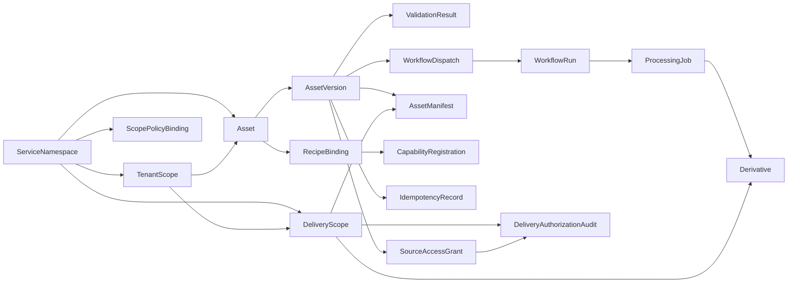

# Domain Model

This document defines the core platform records and the control-plane semantics they must preserve.

The domain model is the backbone of the architecture. If these records are vague, the API, workflow, and operator surfaces will become vague too.

## 1. Core records

| Record | Purpose |
| --- | --- |
| `ServiceNamespace` | registers an internal service or domain using the platform |
| `TenantScope` | represents an optional external tenant or customer isolation boundary within a namespace |
| `Asset` | logical asset identity across versions |
| `AssetVersion` | immutable uploaded source version of an asset |
| `DeliveryScope` | modeled delivery URL, cache, and authorization boundary |
| `Derivative` | deterministic derived artifact published for delivery |
| `AssetManifest` | published delivery manifest for a version |
| `WorkflowRun` | durable workflow instance |
| `ProcessingJob` | unit of workflow-owned execution |
| `ValidationResult` | validation output for a version or derivative |
| `RecipeBinding` | mapping between an asset capability and a recipe |
| `CapabilityRegistration` | file-type and processor support declaration |
| `ScopePolicyBinding` | programmatic authorization and scoping rules attached to a namespace |
| `IdempotencyRecord` | durable evidence for retry-safe mutation handling |
| `WorkflowDispatch` | durable workflow-start intent written by the request path |
| `AuditEvent` | operator and system audit trail |

## 2. Identity model

The platform must distinguish these concepts explicitly:

- `ServiceNamespace`: the internal adopting service or domain, such as `creative-services`
- `TenantScope`: the customer, workspace, or external isolation boundary inside that namespace
- `AssetOwner`: the caller-facing owner or subject used in access-control checks

Rules:

1. a namespace is not a tenant
2. a tenant is not a workflow queue
3. an asset owner is not necessarily the same thing as a tenant identifier

The registry should model these separately so auth, billing, reporting, and delivery visibility do not get coupled accidentally.

Authorization policy should be evaluated over attributes, not only over static roles.

## 3. Key relationships

## 4. Record responsibilities

### 4.1 `ServiceNamespace`

Represents the internal adopting service boundary.

Should include:

- namespace ID
- owning team
- default lifecycle and visibility policy
- allowed capabilities and recipes
- tenant-isolation mode
- metadata schema registration
- scope policy binding set

### 4.2 `TenantScope`

Represents the external isolation boundary when a namespace is multi-tenant.

Should include:

- namespace linkage
- external tenant ID
- status
- policy overrides where allowed

If a namespace is effectively single-tenant or internal-only, this record may be absent, but the model should still preserve the distinction.

### 4.3 `Asset`

Represents the stable logical identity used by external APIs and internal services.

Should include:

- service namespace
- tenant scope where applicable
- asset owner reference
- asset class
- scope key or equivalent scoped lookup field
- visibility and retention policy
- current canonical-version pointer where appropriate
- mutable publication pointer version for optimistic concurrency

One `Asset` represents the stable logical identity across revisions. Uploading a new revision should create a new `AssetVersion`, not mutate the prior one.

### 4.4 `AssetVersion`

Represents one immutable uploaded source version.

Should include:

- repository engine
- canonical repository identity
- snapshot or manifest identity for reconstruction
- canonical logical source path
- source filename and detected content type
- ingest-target reference
- upload completion state
- canonicalization state
- validation state
- source checksum or equivalent integrity marker
- logical size and stored size when available
- repository-native reconstruction handles when available
- source-download policy or visibility posture where it differs from derivative delivery
- optional canonicalization and deduplication metrics for observability
- optional normalization evidence summary, clearly separated between generic fallback evidence and capability-scoped semantic evidence

Once a version reaches `canonical`, the source identity must be immutable.

Sibling versions under the same `Asset` may share deduplicated storage underneath in the canonical source plane, but they remain distinct business identities with separate lifecycle state, workflow dispatch, derivatives, manifests, and audit history.

### 4.5 `DeliveryScope`

Represents the delivery boundary through which an organization or audience accesses published artifacts and, where policy allows, materialized source exports.

Should include:

- service namespace linkage
- tenant scope or organization linkage where applicable
- delivery mode such as shared-path, subdomain, or custom-hostname
- hostname and path-prefix configuration
- authorization mode such as public, signed URL, or signed cookie
- cache profile
- stream-bundle policy where applicable

This keeps organization-specific URLs, private bundle access, cache behavior, and materialized source-export posture modeled explicitly.

### 4.6 `Derivative`

Represents one deterministic published output.

Should include:

- source asset and version linkage
- recipe identifier
- schema version
- deterministic delivery key
- delivery-scope linkage
- scoped storage prefix components
- content metadata
- publication state
- publication checksum or ETag where relevant

### 4.7 `AssetManifest`

Represents the published delivery description for complex asset classes.

Should include:

- manifest type
- source asset and version linkage
- referenced derivative set
- delivery-scope linkage
- dimensions, codecs, checksums, and ordering where relevant
- schema version
- active publication pointer version for optimistic concurrency

### 4.8 `WorkflowRun` and `ProcessingJob`

These represent orchestration, not business identity.

- `WorkflowRun` tracks the durable orchestration instance
- `ProcessingJob` tracks recipe- or step-scoped execution units

They should remain operator-visible and correlated with derivatives, validation outcomes, and asset versions.

`WorkflowRun` should also project:

- current durable run state
- current step or phase
- wait reason where applicable
- retry summary
- cancellation cause where applicable

### 4.9 `ScopePolicyBinding`

Represents the code-defined programmatic scoping and authorization rules for a namespace.

Should include:

- service namespace linkage
- policy model version
- allowed subject classes
- required resource attributes
- action bindings
- environment constraints where relevant

This is how a namespace states, in code, what its uploaders and readers are allowed to do.

### 4.10 `IdempotencyRecord`

Represents the durable retry contract for a mutating endpoint.

Should include:

- API surface
- caller scope
- route or operation key
- idempotency key
- normalized request hash where relevant
- terminal response reference

### 4.11 `WorkflowDispatch`

Represents a durable workflow-start intent created by the request path.

Should include:

- target workflow ID
- asset and version linkage
- dispatch reason
- dispatch state
- first-attempt timestamp
- last-attempt timestamp

This is the outbox-style handoff between synchronous API mutation and asynchronous workflow start.

## 5. SQL and concurrency posture

The default metadata database is PostgreSQL with JSONB for:

- extensible metadata fields
- processor result payloads
- manifest fragments
- governed namespace-specific metadata

Additional posture:

- mutable control-plane rows should use explicit version columns or equivalent concurrency tokens
- JSONB query paths should use deliberate GIN indexes instead of generic over-indexing
- deployments that require stronger tenant isolation may use PostgreSQL row-level security in addition to application auth
- scoped queries should use composite filters over namespace, tenant scope, and resource ID rather than unscoped resource IDs alone

## 6. Registry questions this model must answer

The registry should make it easy to answer:

- which namespace owns this asset
- which tenant scope owns this asset, if any
- which uploaded version is canonical
- which recipes were bound and why
- which derivatives exist and where they are published
- which workflow run or job produced a derivative
- which validation result blocked or allowed processing
- which workflow dispatch intent has or has not been started
- which scope policy governs this asset and caller combination
- which delivery scope governs the URL and auth behavior for this asset
- which operator action changed the asset lifecycle most recently

## 7. References

- [Kopia features](https://kopia.io/docs/features/)
- [SeaweedFS tiered storage](https://github.com/seaweedfs/seaweedfs/wiki/Tiered-Storage)
- [Prisma transactions, idempotent APIs, and OCC](https://www.prisma.io/docs/orm/prisma-client/queries/transactions)
- [Prisma index configuration](https://docs.prisma.io/docs/orm/prisma-schema/data-model/indexes)
- [PostgreSQL row security policies](https://www.postgresql.org/docs/current/ddl-rowsecurity.html)
- [RFC 8216: HTTP Live Streaming](https://www.rfc-editor.org/rfc/rfc8216.html)
- [RFC 8246: HTTP Immutable Responses](https://www.rfc-editor.org/rfc/rfc8246.html)
- [Architecture](./architecture.md)
- [Service Registration Model](./service-registration-model.md)
