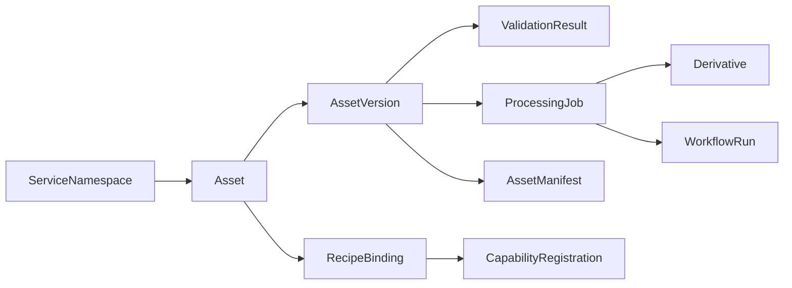

# Domain Model

This document defines the core platform records and how they relate to one another.

The domain model is the backbone of the control plane. If these records are vague, the workflow, API, and operator surfaces will become vague too.

## 1. Core records

| Record | Purpose |
| --- | --- |
| `ServiceNamespace` | registers an internal service or domain using the platform |
| `Asset` | logical asset identity across versions |
| `AssetVersion` | immutable uploaded version of an asset |
| `Derivative` | deterministic derived artifact published for delivery |
| `ProcessingJob` | unit of workflow-owned execution |
| `WorkflowRun` | durable workflow instance |
| `ValidationResult` | validation output for a version or derivative |
| `RecipeBinding` | mapping between an asset capability and a recipe |
| `CapabilityRegistration` | file-type and processor support declaration |
| `AssetManifest` | delivery manifest for complex assets |
| `AuditEvent` | operator and system audit trail |

## 2. Key relationships

## 3. Record responsibilities

### 3.1 `Asset`

Represents the stable logical identity used by external APIs and internal services.

Should include:

- owner namespace or tenant
- asset class
- visibility and retention policy
- current canonical-version pointer where appropriate

### 3.2 `AssetVersion`

Represents one immutable uploaded source version.

Should include:

- Oxen source reference
- source filename and detected content type
- upload completion state
- validation state
- source checksum or equivalent integrity marker

### 3.3 `Derivative`

Represents one deterministic published output.

Should include:

- source asset and version linkage
- recipe identifier
- schema version
- deterministic delivery key
- content metadata
- publication state

### 3.4 `WorkflowRun` and `ProcessingJob`

These represent orchestration, not business identity.

- `WorkflowRun` tracks the durable orchestration instance
- `ProcessingJob` tracks recipe- or step-scoped execution units

They should remain operator-visible and correlated with derivatives and validation outcomes.

### 3.5 `AssetManifest`

Represents the published delivery description for complex asset classes.

Should include:

- manifest type
- referenced derivative set
- dimensions, codecs, checksums, and ordering where relevant
- schema version

## 4. SQL posture

The default metadata database is PostgreSQL with JSONB for:

- extensible metadata fields
- processor result payloads
- manifest fragments
- schema-evolution pressure relief

Adopters may use another SQL database if they preserve the same registry semantics, constraints, and API contract.

## 5. Registry questions this model must answer

The registry should make it easy to answer:

- which namespace owns this asset
- which uploaded version is canonical
- which recipes were bound and why
- which derivatives exist and where they are published
- which workflow run or job produced a derivative
- which validation result blocked or allowed processing
- which manifest revision is currently published
- which operator action changed the asset lifecycle most recently

## 6. References

- [PostgreSQL JSON types](https://www.postgresql.org/docs/current/datatype-json.html)
- [Architecture](./architecture.md)
- [Service Registration Model](./service-registration-model.md)
