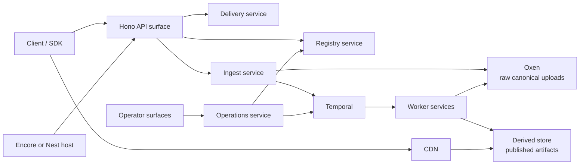
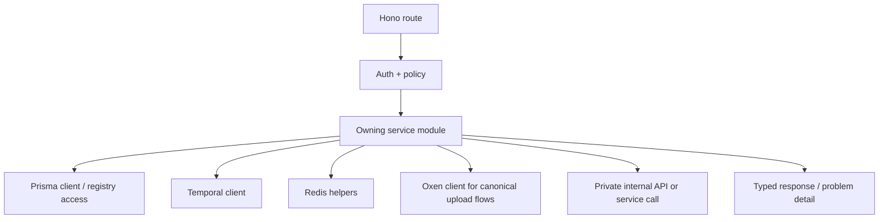
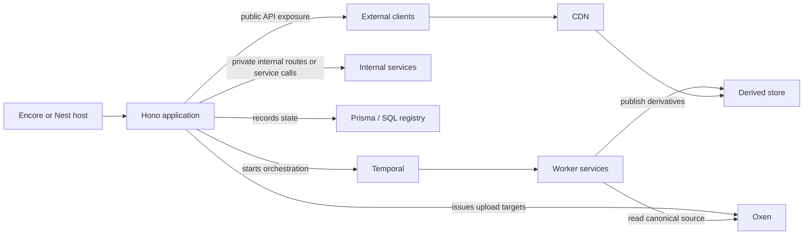

# Service Architecture

This document focuses on the actual backend service shape of CDNgine rather than the asset-processing tools alone.

The goal is to make the service itself fast, maintainable, durable, and easy to evolve while keeping the HTTP layer portable across runtime environments.

The default direction is:

- **Hono** for the HTTP and API surface
- **Prisma** for database access and migrations
- **Encore or Nest** as supported host environments around the same service core

## 1. Service boundaries

The default service shape should separate:

- **public API surfaces** for upload sessions, completion, metadata, and signed delivery orchestration
- **private internal service surfaces** for workflow triggers, capability resolution, and platform-owned commands
- **worker-facing orchestration surfaces** for durable processing and replay
- **operator service surfaces** for replay, diagnostics, quarantine, and administrative actions

These can begin as one repository and one deployable composition, but they should not blur their responsibilities.

## 2. Default TypeScript service profile

The current leading service-level stack is:

| Concern | Default |
| --- | --- |
| runtime language | TypeScript |
| HTTP and API layer | Hono |
| host environment | portable between Encore and Nest |
| validation and schema authoring | Zod plus JSON Schema alignment |
| API description | OpenAPI 3.1 derived from the published external surface |
| event description | AsyncAPI where helpful |
| database access | Prisma over PostgreSQL |
| telemetry | OpenTelemetry |
| logging | structured application logging with request and workflow correlation |
| durable workflows | Temporal TypeScript SDK |

## 3. Why this shape

### 3.1 Hono

Hono is the preferred HTTP layer because it is:

- fast and lightweight
- based on Web Standard APIs
- multi-runtime
- TypeScript-friendly
- small enough to embed inside different host environments without dragging in an opinionated full-stack model

For CDNgine, that makes Hono a better foundation than tying the architecture to a single full-service framework.

### 3.2 Portable host posture: Encore or Nest

The platform should not assume that the HTTP layer and the deployment/runtime shell are the same thing.

The intended split is:

- **Hono** owns routing, request/response handling, middleware, and public/private API boundaries
- **Encore or Nest** may host, compose, or integrate those surfaces depending on deployment and organizational preference

This keeps the service core flexible:

- Encore can provide strong local infrastructure and service discovery ergonomics
- Nest can provide module-oriented application composition for teams already standardized on Nest
- neither host should force changes to the public API contract, Oxen provenance model, or Temporal workflow model

### 3.3 Zod plus JSON Schema alignment

Zod remains useful for:

- runtime validation
- reusable schema fragments
- schema reuse across manifests, capability definitions, and registry-owned config

Published contracts should still center on OpenAPI and JSON Schema.

### 3.4 Prisma

Prisma is the preferred database layer because it gives the platform:

- type-safe database access
- one schema language for relational modeling and migrations
- generated client ergonomics
- a clearer migration story than ad hoc SQL scripts plus hand-rolled conventions

Prisma should be used for the registry's main relational model, while raw SQL remains acceptable where the platform needs query shapes Prisma does not express cleanly.

### 3.5 OpenTelemetry

The platform needs vendor-neutral traces, metrics, and logs. OpenTelemetry remains the default for keeping the service observable without binding the architecture to one vendor.

### 3.6 Temporal

Hono and the chosen host environment improve service structure and portability, but they are not the systems we are using for long-running asset derivation orchestration. Temporal still owns:

- durable retries
- timers
- execution history
- replay
- operator-visible workflow semantics

## 4. Portable service model for CDNgine

The application should be organized around narrow service ownership that survives host-environment changes.

Recommended service areas:

| Service | Responsibility |
| --- | --- |
| `ingest` | upload sessions, upload completion, lightweight policy checks |
| `registry` | asset, version, derivative, and manifest state |
| `delivery` | signed URLs, manifest retrieval, derivative lookup |
| `capabilities` | capability registration, recipe binding resolution |
| `operations` | replay, quarantine, purge, diagnostics |
| `workflow-gateway` | starts and coordinates Temporal workflows from service boundaries |

The Hono route tree should stay thin. Host-specific composition should wrap these services, not replace their ownership model.

## 5. Request path posture

The synchronous request path should do only the work that belongs in a direct request boundary:

- authentication and authorization
- schema validation
- idempotency check
- lightweight policy binding
- asset or version record mutation
- workflow start or command dispatch

The request path should not:

- do expensive transforms
- hide long retries
- run long remote dependency chains
- quietly become a second workflow engine

## 5.1 Plain-language ingest and delivery contract

To avoid ambiguity:

- **ingest** means the client uploads the original binary to **Oxen**
- **processing** means workers read that canonical source from **Oxen** and publish generated outputs to the **derived store**
- **delivery** means clients fetch published outputs from the **CDN** in front of the **derived store**

So the service contract is:

1. Hono API creates upload session and asset/version state
2. client uploads original to Oxen
3. Hono API marks upload complete and starts Temporal workflow
4. workers read the canonical source from Oxen
5. workers write deterministic outputs to the derived store
6. clients receive manifests and delivery URLs from the API
7. clients fetch published artifacts from the CDN-backed derived store

Oxen is therefore on the **canonical ingest and replay path**, not on the ordinary **published derivative delivery path**.

## 6. Idempotency posture

Every mutating boundary should define:

- idempotency key scope
- storage location for idempotency evidence
- retry-safe response behavior
- operator-visible failure mode

Redis can help with short-lived dedupe windows, but durable idempotency state belongs in the registry or workflow system where appropriate.

## 7. Service-level diagrams

### 7.1 Portable service decomposition

### 7.2 Internal service flow

### 7.3 Responsibility split

## 8. TDD and maintainability posture

The service should be built in this order:

1. docs and contract
2. failing specification or route test
3. narrower unit or integration tests
4. implementation
5. workflow and replay evidence where needed

The service design should prefer:

- explicit service ownership
- small service modules behind Hono routes
- typed boundaries
- clear Prisma schema ownership and migration discipline
- reusable workflow templates
- host portability between Encore and Nest where feasible

## 9. References

- [Hono](https://hono.dev/)
- [Prisma ORM](https://www.prisma.io/docs/orm)
- [OpenTelemetry docs](https://opentelemetry.io/docs/)
- [OpenAPI Specification](https://spec.openapis.org/oas/latest.html)
- [AsyncAPI docs](https://www.asyncapi.com/docs)
- [Temporal TypeScript SDK](https://github.com/temporalio/sdk-typescript)
- [Encore.ts documentation](https://encore.dev/docs/ts)
- [NestJS documentation](https://docs.nestjs.com/)
