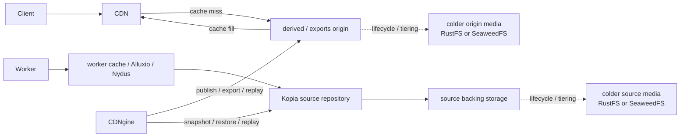

# Storage Tiering And Materialization

This document defines how CDNgine should place bytes across hot, warm, and cold storage while keeping source history small and delivery fast.

## 1. Why this document exists

The platform has two conflicting goals:

1. retain huge iterative source assets cheaply
2. serve hot outputs and repeated internal reads quickly

Those goals should not be solved by one undifferentiated bucket.

## 2. Byte-placement model

| Layer | Primary concern | Default reference |
| --- | --- | --- |
| canonical source repository | deduplicated snapshot history for immutable source versions | Kopia |
| tiered operational substrate | local and cloud placement, disk classes, S3 access, replication | SeaweedFS by default, JuiceFS when POSIX semantics matter |
| worker hot cache | repeated chunk or file reads close to compute | worker-local cache, optional Alluxio |
| lazy-read representation | on-demand reads for package-like or rebuildable assets | Nydus |
| artifact graph | immutable bundle and manifest references | ORAS / OCI artifacts |
| browser delivery store | CDN-friendly whole objects and manifests | S3-compatible derived store |

## 3. Hot, warm, and cold rules

### 3.1 Hot

Hot bytes are those needed repeatedly in a short window:

- active worker input chunks
- frequently read package-like assets
- current published derivatives
- artifact indexes and manifests

### 3.2 Warm

Warm bytes are still likely to be reused soon, but do not justify the most expensive placement:

- recent source versions from active projects
- recent derived outputs outside the hottest window
- reusable intermediate bundles

### 3.3 Cold

Cold bytes are reconstructable history:

- older source revisions
- rarely requested exports
- purge-protected provenance evidence

Cold does not mean inaccessible. It means reconstructable without paying hot-storage costs everywhere.

## 4. Materialization rules

Preferred policy:

1. do not permanently store every possible derivative
2. materialize hot browser-facing outputs when demand or policy justifies it
3. keep chunked or snapshot forms as the durable truth for large iterative sources
4. let workers or trusted tools use lazy chunk-aware reads where it improves throughput
5. evict materialized outputs when they are cheaper to rebuild than to store forever

## 5. Default product posture

The default product posture is:

- **source assets**: always snapshot into **Kopia**
- **published web outputs**: materialize into the derived store and serve via CDN
- **package-like internal hot reads**: prefer **Nydus** when compatible with the consumer
- **artifact bundles and manifests**: publish through ORAS where an immutable bundle graph is helpful

CDNgine should integrate these systems, not clone their behavior in application code.

### 5.1 Bucket and prefix organization

The storage topology may use one S3-compatible namespace or several.

Example one-bucket layout:

- `{bucket}/ingest/` for resumable upload staging
- `{bucket}/source/` for the Kopia-backed canonical source repository
- `{bucket}/derived/` for deterministic CDN-facing derivatives
- `{bucket}/exports/` for repeated original-source downloads when export mode is enabled

Example multi-bucket layout:

- `cdngine-ingest`
- `cdngine-source`
- `cdngine-derived`
- `cdngine-exports`

The client contract stays the same in both cases. CDNgine authorizes one read and resolves it to the right prefix, bucket, cache, or proxy path internally.

## 6. Promotion and demotion signals

The orchestrator should use explicit signals such as:

- recent access frequency
- queue backlog pressure
- rebuild cost
- source-size and chunk reuse
- tenant or namespace retention policy
- current storage pressure
- publication or SLA requirements

### 6.1 Who actually moves bytes

CDNgine should **not** be read as "the application contains a custom hot/cold mover library."

The intended ownership model is:

| Movement type | Owned by | What actually happens |
| --- | --- | --- |
| edge caching for published artifacts | CDN | cache fill on miss, TTL-based reuse, and eviction of edge copies |
| origin-object hot/warm/cold transitions in simple S3-compatible deployments | RustFS | bucket lifecycle and policy-based object tiering move objects between storage classes or tiers |
| substrate hot/warm/cold transitions in fuller deployments | SeaweedFS | tiered storage configuration and administrative movement place volumes on different disk classes or cloud tiers |
| worker-side repeated-read acceleration | worker-local cache, optional Alluxio, optional Nydus | repeated source reads are promoted close to compute without changing the public delivery contract |
| business-level publication or export materialization | CDNgine workflows and workers | create new derivatives, exports, or replay outputs when policy requires a new whole object |

There is therefore **no normal "move bytes from CDN to cold" operation**. The CDN is a cache in front of the delivery origin. The origin storage layer owns hot/warm/cold placement.

### 6.2 Movement model

### 6.3 Where the behavior lives

In the reference architecture:

1. **CDN behavior** lives in the CDN product configuration, not in CDNgine route handlers.
2. **RustFS behavior** lives in RustFS lifecycle and policy-based object-tiering rules when RustFS is the chosen S3-compatible substrate.
3. **SeaweedFS behavior** lives in SeaweedFS disk-tier configuration and `volume.tier.move`-style administrative flows when SeaweedFS is the chosen substrate.
4. **Alluxio and Nydus behavior** lives close to workers as read-path acceleration, not as public delivery storage.
5. **CDNgine behavior** lives in policy, registry state, workflow orchestration, publication, export materialization, and replay.

### 6.4 Local fast-start versus fuller deployments

The current local fast-start stack uses **RustFS** as the S3-compatible backing store because it is simple to run. That profile does **not** yet ship a full lifecycle-policy setup in this repository.

That means:

- local fast-start proves the API, staging, canonicalization, publication, and delivery contracts
- a simple RustFS-based deployment can still use RustFS lifecycle-tiering rules when the operator configures them
- the fuller reference posture still prefers **SeaweedFS** when explicit hot/warm/cold substrate control becomes a hard requirement

## 7. Research-backed bleeding-edge posture

The fastest credible design for CDNgine is **not** "put everything behind one smart cache."

The better model, supported by current systems papers and upstream products, is:

1. keep **immutable canonical originals** separate from delivery artifacts
2. use **multiple hot paths** tuned for different read shapes
3. make tiering decisions from **age + access + rebuild cost + resource pressure**
4. prefer **fine-grained promotion** for tiny high-reuse objects
5. use **temporary mirroring** for bursty hot objects instead of only migration
6. treat **learned policies as shield-level optimizations**, not as a first-day dependency

### 7.1 What to implement now

These are the aggressive defaults CDNgine should adopt first.

#### A. Immutable source, disposable derivatives

Follow the same broad direction reinforced by newer lifecycle systems such as DynoStore:

- every canonical source version is immutable
- changes create a new source version instead of mutating old bytes
- retention, purge, and legal-hold behavior operate on versioned records
- published derivatives are deterministic outputs that can be regenerated from canonical source plus recipe and schema version

This keeps rollback, replay, purge, and audit semantics clear.

#### B. Three separate hot paths

CDNgine should optimize three different hot sets, not one:

| Hot path | What stays hot | Why |
| --- | --- | --- |
| CDN edge | most-requested published derivatives and exports | lowest client latency |
| origin hot tier | newly published or repeatedly requested derivatives, manifests, selected exports | fast shield/origin fetch on cache miss |
| compute-local hot tier | source chunks, unpacked working sets, lazy-read pages | fast worker throughput and replay |

Trying to merge these into one cache makes policy too blunt.

#### C. Fine-grained promotion for metadata and tiny objects

HotRAP's key lesson applies directly even though it studies LSM-backed storage: **promote small hot records individually** instead of waiting for coarse object or volume movement.

For CDNgine that means the following should get promoted faster than large binaries:

- manifests
- manifest fragments
- recipe-resolution outputs
- derivative metadata
- source-access authorization metadata
- small preview or poster artifacts with very high fan-out

These objects have outsized latency impact and small capacity cost.

#### D. Mirror bursty hot objects instead of only migrating them

MOST's key insight is useful for derivative delivery: when demand shifts quickly, **temporary mirroring of a small hot set** can outperform pure migration.

For CDNgine, use this idea for:

- derivatives that suddenly go viral after publish
- release bundles with burst traffic
- hot exports that reappear during review or incident response

That means a hot object may exist briefly in both a hotter tier and a colder origin tier, instead of waiting for one full migration to finish.

#### E. Multi-resource budgets, not cache-only tuning

HARE's lesson is that cache sizing alone is not enough. Promotion should respect:

- cache capacity
- origin I/O budget
- worker CPU budget
- network egress budget
- tenant fairness

In practice, CDNgine should only prewarm or mirror when the system has enough headroom and the asset's expected savings justify the resource cost.

#### F. Aggressive but explicit lifecycle classes

Recommended starting posture:

| Object class | Default posture |
| --- | --- |
| canonical originals | immutable, snapshot immediately, keep repository metadata and indexes hot, allow bulk chunks to cool aggressively after active window |
| derived delivery objects | publish hot, keep in CDN plus hot origin while demand is fresh, demote after decay, rebuild when cheaper than storing forever |
| source exports | materialize on demand, keep briefly hot, expire quickly unless policy pins them |
| manifests and tiny metadata | keep hotter and longer than bulk blobs because fan-out is high and rebuild cost is small but latency sensitivity is high |
| ORAS bundles and release artifacts | keep warm while release is active, then cool or archive according to retention policy |

### 7.2 What to pilot after the baseline works

These are promising, but they should come **after** the basic source-to-delivery path is stable.

#### A. Learned eviction at the origin shield

3L-Cache is the right kind of paper to borrow from because it focuses on learned eviction with lower overhead.

Use that direction only for:

- origin shield cache
- derived-store hot tier
- export hot tier

Do **not** make learned eviction a hard dependency of:

- the canonical source repository
- the public API contract
- the local fast-start profile

Start with a cost-aware adaptive policy, then test learned eviction on real traces.

#### B. Predictive prewarm for bursty media

Use popularity and event-driven prewarm only where bursts are common, for example:

- video campaigns
- event media
- recently published assets promoted by an upstream product event

This should be opt-in and driven by measurable recall and wasted-warm-rate metrics.

#### C. Smarter hotness classifiers

Adaptive hotness identification such as Multigrain-style approaches is useful for deciding:

- whether an object deserves mirroring instead of plain migration
- whether a derivative should stay in hot origin storage after CDN churn
- whether an export should be kept around or rebuilt on demand

But that belongs in the lifecycle controller, not scattered across routes or workers.

### 7.3 Canonical-source performance posture

The canonical source plane should be fast, but it should remain a **safe provenance system first**.

#### A. Near-compute acceleration before repository surgery

Before changing repository internals, prefer:

- worker-local caches
- optional Alluxio for repeated source reads
- Nydus-style lazy reads for suitable package-like assets
- hot indexes and metadata placement in the underlying source substrate

These give major gains without breaking source semantics.

#### B. Treat new CDC algorithms as study material unless benchmarks justify change

Chonkers and SeqCDC point in an exciting direction:

- better edit locality and tighter chunk-size guarantees
- much higher chunking throughput through vectorization and skipping

But CDNgine currently consumes **Kopia** as the canonical source repository. That means CDC changes are **not** an application-level default. They are a possible future repository or substrate evaluation.

The correct posture is:

1. benchmark current canonicalization throughput on real corpora
2. measure where the bottleneck actually is: chunking, hashing, network, or repository I/O
3. only consider repository-level CDC replacement or extension if chunking is truly the limiting factor

#### C. Security posture for deduplication

The "Breaking and Fixing Content-Defined Chunking" result matters for CDNgine because it shows that keyed CDC schemes can still leak useful information.

So CDNgine should:

- avoid exposing chunk boundaries, dedup fingerprints, or repository-internal chunk metadata in public APIs
- keep deduplication metadata private to internal adapters and operators
- avoid promising cross-tenant dedup semantics in the public contract
- consider stricter source profiles for sensitive workloads if threat modeling shows CDC leakage is material

### 7.4 Concrete product recommendation

If the goal is **fast, optimized, and bleeding-edge without being reckless**, CDNgine should do this:

1. **Keep Kopia as the canonical source repository** for now.
2. **Use SeaweedFS as the richer production substrate** when explicit hot/warm/cold placement matters.
3. **Use RustFS only as the simple S3-compatible profile** unless its lifecycle controls are sufficient for the deployment.
4. **Keep CDN delivery and origin lifecycle separate.**
5. **Add an origin-shield lifecycle controller** that scores objects by demand, size, rebuild cost, and recency.
6. **Promote metadata and small high-fanout artifacts more aggressively than bulk blobs.**
7. **Use temporary mirroring for bursty hot derivatives** instead of only migrating objects between tiers.
8. **Pilot learned eviction only at the shield/origin layer** after traces prove it is worth the operational cost.
9. **Use Nydus and optional Alluxio only for worker-side hot reads**, not as public delivery storage.
10. **Keep exports ephemeral by default** and regenerate from canonical source when that is cheaper than long retention.

That is the most aggressive architecture I would currently recommend that still fits CDNgine's existing model.

## 8. Read more

- [Architecture](./architecture.md)
- [Canonical Source And Tiering Contract](./canonical-source-and-tiering-contract.md)
- [Original Source Delivery](./original-source-delivery.md)
- [Environment And Deployment](./environment-and-deployment.md)
- [SeaweedFS tiered storage](https://github.com/seaweedfs/seaweedfs/wiki/Tiered-Storage)
- [Alluxio overview](https://documentation.alluxio.io/os-en)
- [Nydus](https://nydus.dev/)
- [DynoStore](https://arxiv.org/abs/2507.00576)
- [Mirror-Optimized Storage Tiering (MOST)](https://arxiv.org/abs/2512.03279)
- [HotRAP](https://www.usenix.org/conference/atc25/presentation/qiu)
- [HARE](https://www.usenix.org/conference/fast26/presentation/ye)
- [3L-Cache](https://www.usenix.org/conference/fast25/presentation/zhou-wenbin)
- [The Chonkers Algorithm](https://arxiv.org/abs/2509.11121)
- [SeqCDC](https://arxiv.org/abs/2505.21194)
- [Breaking and Fixing Content-Defined Chunking](https://eprint.iacr.org/2025/558)
